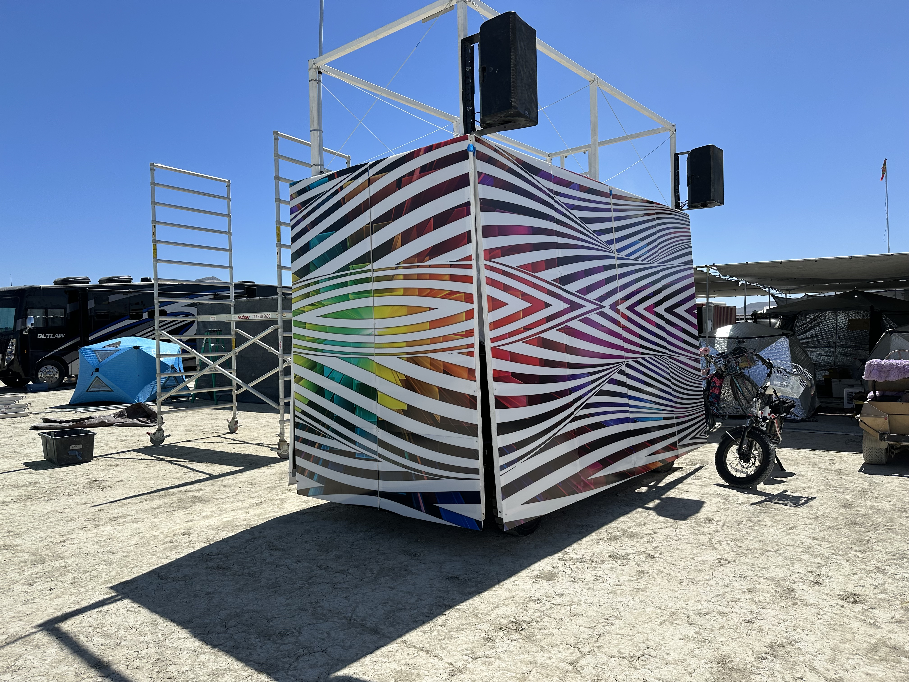
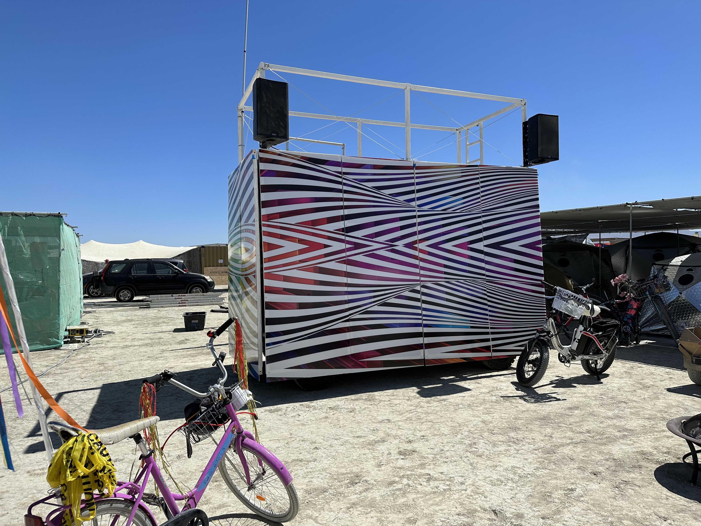

# GLORB

**G**alactic **L**ight **O**perated **R**ecreational **B**eahemoth

*An electric, remote-controlled art car for Burning Man — and for 2026, a giant glowing broom.*

Glorb is a 4 m × 1.8 m two-story electric platform that rolls across the playa at walking pace, carrying a DJ rig, a dance floor, a rooftop deck, and an unspecified number of secrets. It runs entirely on salvaged Tesla Model S battery modules — a 72 V drive pack under the floor plus a dedicated 24 V bank for the lights — and is driven by remote control. Glorb does not have a driver's seat. Glorb does not believe in seats.

## 2026: the broom

This year the car becomes a broom. Why a broom? The committee has asked that we not ask. **136 flexible silicone LED tubes**, each 2.5 m long and individually addressable, hang like bristles around three sides of the car (the front-left side stays open so the driver can see where the broom is sweeping). A stripper pole on the upper deck is the handle. It is a very large broom. It sweeps nothing. It is perfect.

- **5,576 pixels — about 65,000 physical LEDs** — on **136 independent data lines**, driven by a single Kulp K128D-B (BeagleBone + FPP) through ten SRx4 quad receivers — no chaining, no serpentine, no regrets (the regrets were 2026-08 and have been documented).
- **Dedicated 24 V LED bank:** six Tesla modules in parallel (6s6p, ~31.8 kWh) with its own BMS and charger, also feeding a 24 V inverter for the sound system.
- Patterns are pushed over DDP from a laptop app; anyone on the camp's Meshtastic mesh can text the car and it will say what you wrote, out loud, in a voice it did not choose ([meshspeak](meshspeak/)).
- The tubes are BRG, not RGB. Nobody knows why. The tubes will not tell us.
- No pooping on Glorb.

*Photos of the broom coming after the burn — until then, enjoy the 2023 op-art era below.*

Full design: [broom/DESIGN.md](broom/DESIGN.md) · lighting build: [lights/](lights/)

## 2023: the origin

Glorb was born in January 2023 as a rebuild of "Glory," a 2022 art car platform, with a few hard-won goals: a permanent shape (no more on-playa builds), floor-mounted batteries, open sides for sightlines, and a big *WOWww* factor day and night. Founding values: friendship, adaptability, adventure, and — we cannot stress this enough — no pooping. "ONE BIG HAND" was seriously considered as a design direction and has never been formally ruled out.

In May 2023 the original battery pack was swapped for Tesla modules. The 2023 skin was a vinyl-wrapped op-art box under a white rooftop cage with QSC tops on every corner. If you stare at the side panels long enough you will see either a tunnel or the face of God. Results vary.

| | |
| --- | --- |
|  |  |

More: [history.md](history.md)

## Quick stats

| | |
| --- | --- |
| Footprint | 4 000 × 1 800 mm |
| Height | ~3.7 m (12 ft) to the top of the upper deck |
| Speed | ~5 mph, or one (1) brisk walk |
| Weight (built) | ~3 960 lb, roughly 1 adult hippopotamus |
| Drive pack | 6× Tesla Model S modules, 3s2p, 72 V, ~30 kWh, 2× Elcon 6.6 kW chargers |
| LED pack | 6× Tesla Model S modules, 6s6p, ~24 V, ~31.8 kWh |
| Lights | 136 × 2.5 m SM16703 tubes, 5,576 px, Kulp K128D-B + 10 SRx4 |
| Physical LEDs | **~65,280** (136 tubes × 2.5 m × 96 LEDs/m × 2 sides; 12 LEDs per addressable pixel) |
| Sound | Pioneer XDJ-XZ → Mackie Mix8 → QSC KS118 sub + tops |
| Trailer | needs 7 000 lb payload |
| Generators owned | 3 |
| Generators that work | see [generators/](generators/) |
| Beahemoth spelling | intentional, do not fix |
| Pooping on Glorb | no |

Details: [dimensions.md](dimensions.md)

## Repo map

| Folder | What's in it |
| --- | --- |
| [broom/](broom/) | 2026 broom design doc and concept renders |
| [lights/](lights/) | LED tube specs, K128 controller bring-up, tube/port map, power measurements, pattern software |
| [electrical/](electrical/) | Tesla packs, BMS, chargers, inverter, power budget |
| [sound/](sound/) | DJ signal chain and PA gear |
| [meshspeak/](meshspeak/) | Offline Meshtastic → text-to-speech so the mesh can talk through the car |
| [generators/](generators/) | The generator fleet and its ongoing state of repair |
| [materials/](materials/) | Corrugated plastic panels and vinyl wrap |
| [logistics/](logistics/) | Weight, task lists, parts, camp roster, 2026 planning |
| [dimensions.md](dimensions.md) | Car and compartment sizes |
| [history.md](history.md) | Origin story, 2023 build, design philosophy |
| [references.md](references.md) | Links to external Google Sheets |
| [archive/](archive/) | Preserved Drive export: pics, design files, DMV apps (large binaries, mostly git-ignored) |
| [_raw/](_raw/) | Original `.xlsx` source-of-truth dumps |

---

*Glorb is not responsible for anything Glorb says over the mesh.*
