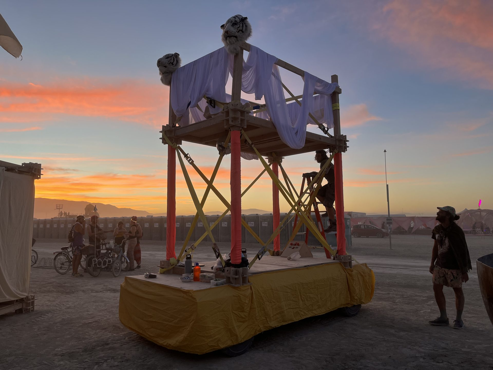
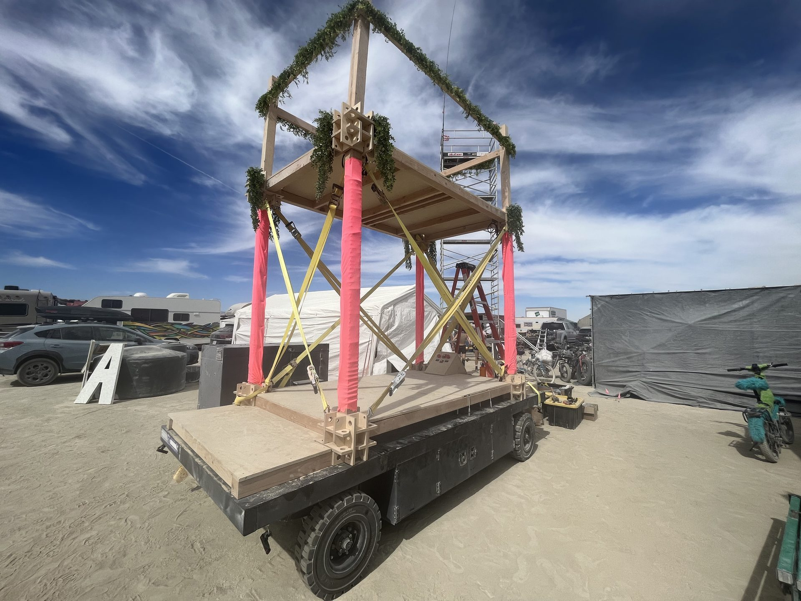
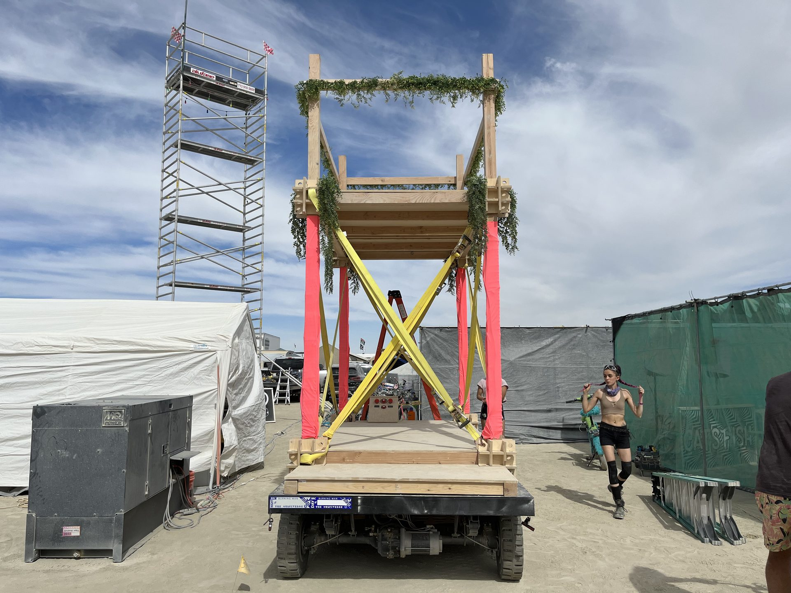
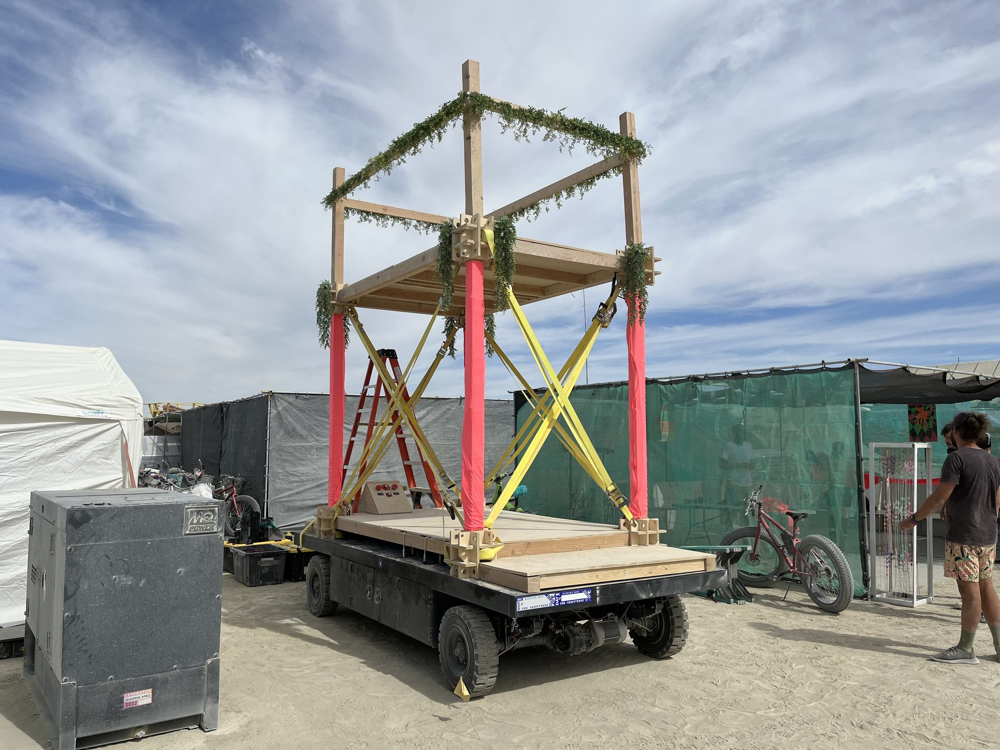
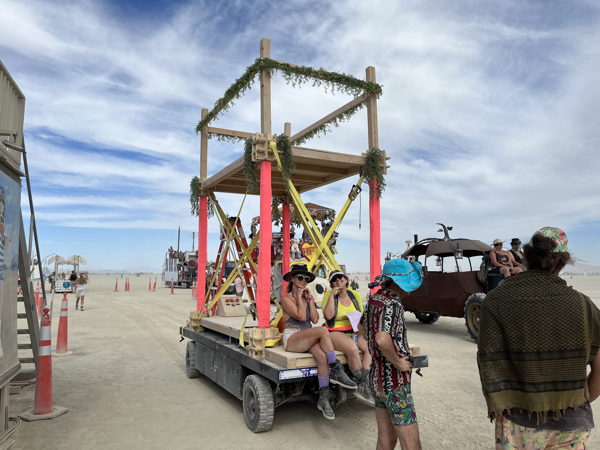
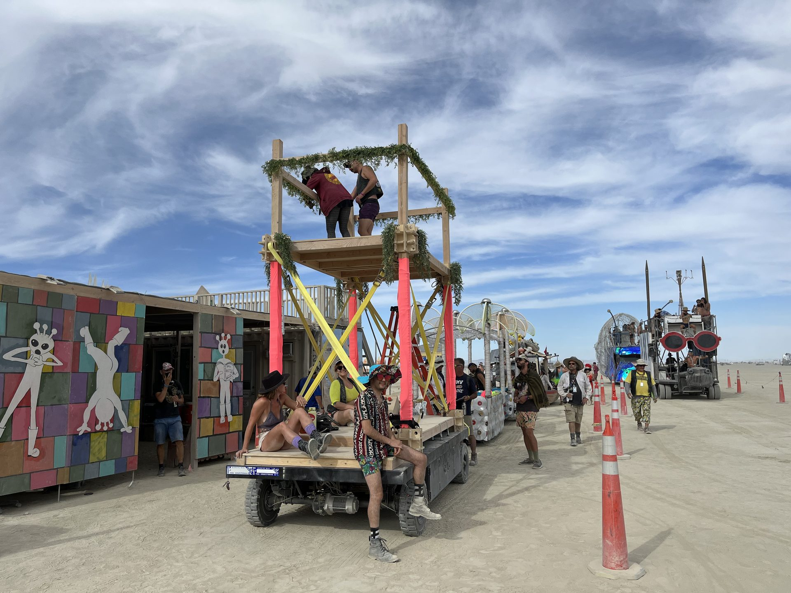
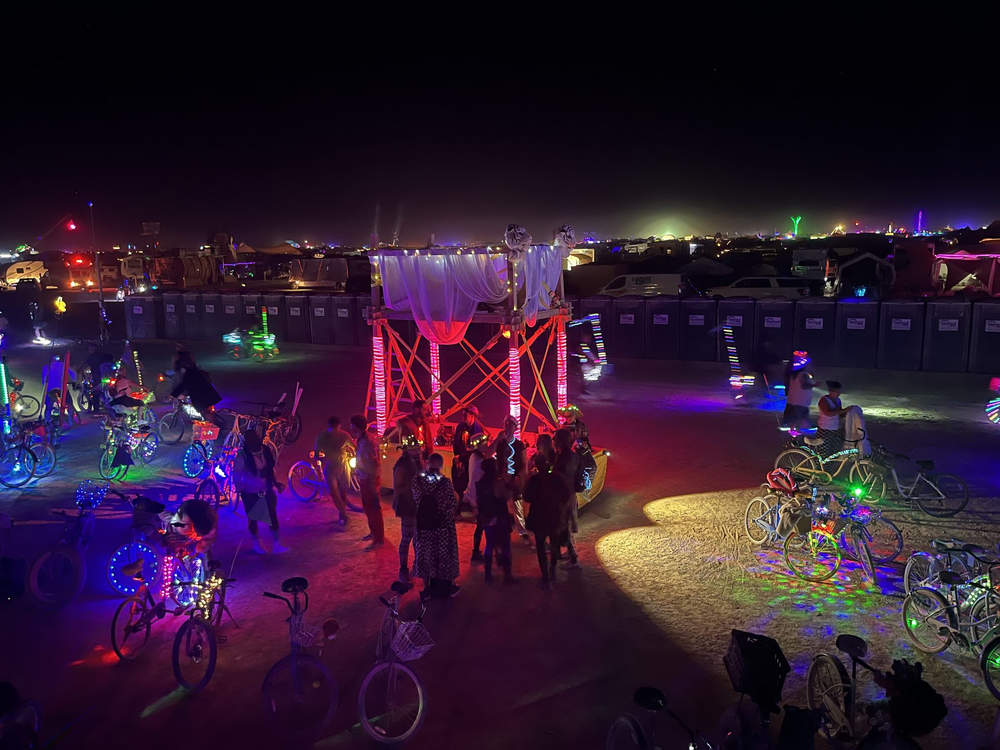
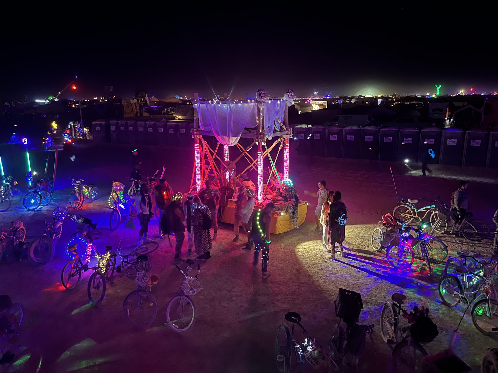

# Glorb: the 2022 original

[← Back to GLORB](../../README.md) · [2023 rebuild history](../../history.md) · [2026 broom gallery](../gallery-2026/)

Before the box. Before the broom. Still Glorb.

Chris confirmed that **Glorb attended Burning Man in 2022** and supplied this archive of the original version. These eight photos show the open two-level platform in daylight, dressed in white and yellow at sunset, and glowing after dark. The year and attendance are owner-confirmed; captions describe only what is visible.

## A lap around the original

All eight supplied stills are included. Click any photo for its optimized JPEG.

### 2580 — Sunset, dressed up

[](glorb-2022-2580.jpg)

White fabric drapes around the upper railing, yellow fabric wraps the base, and crossed supports stand against a sunset sky.

### 2566 — The open platform

[](glorb-2022-2566.jpg)

Corner view of the open wheeled platform, bright pink uprights, yellow crossed supports and greenery along the upper frame.

### 2567 — Straight on

[](glorb-2022-2567.jpg)

End-on view of the two-level frame and crossed supports, with scaffolding beside the car.

### 2568 — Around the corner

[](glorb-2022-2568.jpg)

A daylight corner view of the wheeled platform and upper deck, with pink uprights and yellow crossed supports.

### 2572 — Company on the platform

[](glorb-2022-2572.jpg)

People sit along the platform edge while others stand nearby, beneath the open upper frame.

### 2573 — Room upstairs

[](glorb-2022-2573.jpg)

A wider daylight view with people on and beside the car, including the upper deck.

### 2591 — After dark

[](glorb-2022-2591.jpg)

An elevated nighttime view of the illuminated car, with people gathered nearby and glowing bicycles around it.

### 2594 — A second night view

[](glorb-2022-2594.jpg)

Another elevated view of pink-lit uprights and white upper drapes, surrounded by people and bicycles at night.

## Source, credit and publication notes

- **Credit:** photos supplied by Chris, the project owner; photographer not specified. No photographer attribution or new media license is implied.
- **Historical basis:** Chris's correction establishes 2022 attendance and identifies these as original-version photos. It does not establish exact capture dates or a naming chronology. The older "Glory" wording is discussed in [history.md](../../history.md).
- **Coverage:** eight HEIC stills and six MP4 clips in the supplied archive. All stills are published as JPEGs; original HEICs and video clips are not committed.
- **Web copies:** oriented, pixel-only RGB JPEGs, maximum edge 1,920 px, quality 82, optimized and progressive. EXIF, GPS, XMP, ICC and comments are omitted; originals remain unchanged outside the repository.
- **Provenance:** [manifest.json](manifest.json) records source basenames, SHA-256 hashes and sizes, oriented still dimensions, output hashes/dimensions/sizes and conversion versions. No personal paths or capture metadata are published.

## Rebuild and verify

Requires Python 3.11+ with the pinned conversion versions:

```sh
python -m pip install Pillow==12.3.0 pillow-heif==1.7.0
python docs/gallery-2022/build_gallery.py /path/to/owner-supplied.zip --work-dir /path/to/new-extraction-directory
python docs/gallery-2022/verify_gallery.py
```

Run from the repository root. Extraction must use a new directory outside the repository with room for the full archive. Unsafe paths, symlinks and duplicate basenames are rejected. The build produces JPEGs and the manifest here, and a labeled contact sheet only in the extraction directory. All eight stills and the full sunset hero were visually reviewed for orientation and captions. Different library versions may change encoded hashes.
