# Glorb: the 2026 photo collection

[← Back to GLORB](../../README.md)

The broom has escaped the concept renders. These owner-supplied photographs show Glorb at night: hanging LED bristles, a wheeled platform, an upper deck and a ladder, with several different light patterns. It still sweeps nothing.

## A lap around the broom

All 12 supplied still photographs are included below. Click a photo to open its optimized JPEG. The opening image is also the main README hero.

### 3525 — The whole broom

[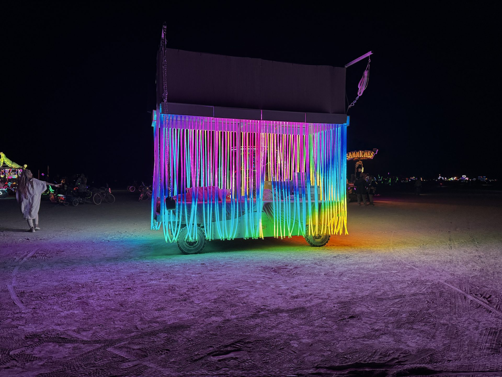](glorb-2026-3525.jpg)

Broadside view of the broom: rainbow bristles around the wheeled platform beneath the upper deck.

### 3520 — Bristles up close

[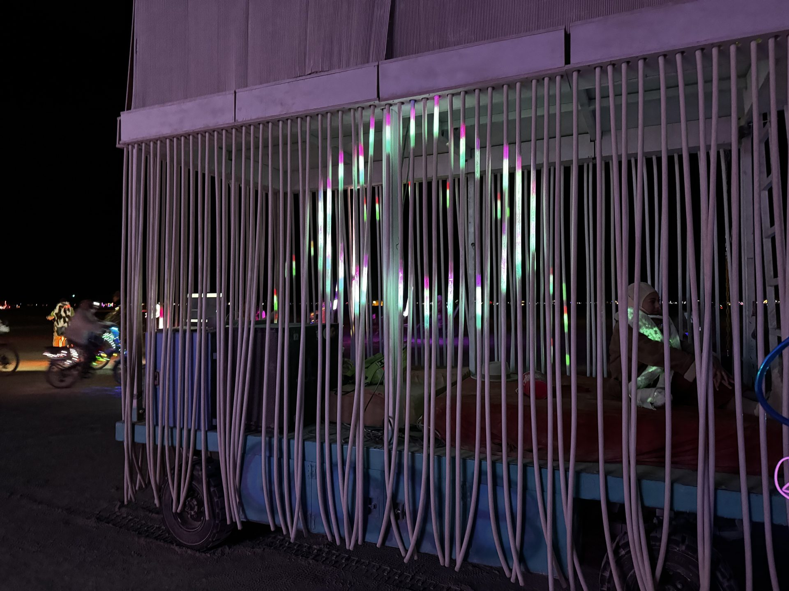](glorb-2026-3520.jpg)

Close-up of the hanging tubes, with scattered white and green light and the platform visible behind them.

### 3521 — Pink points

[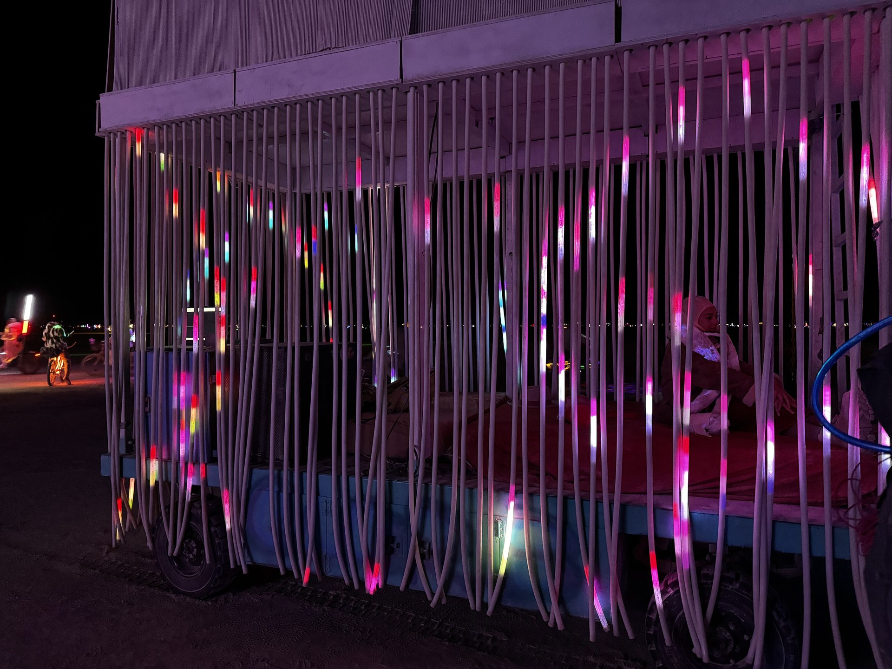](glorb-2026-3521.jpg)

The same close view with pink and white points of light along the bristles.

### 3522 — Light on the ground

[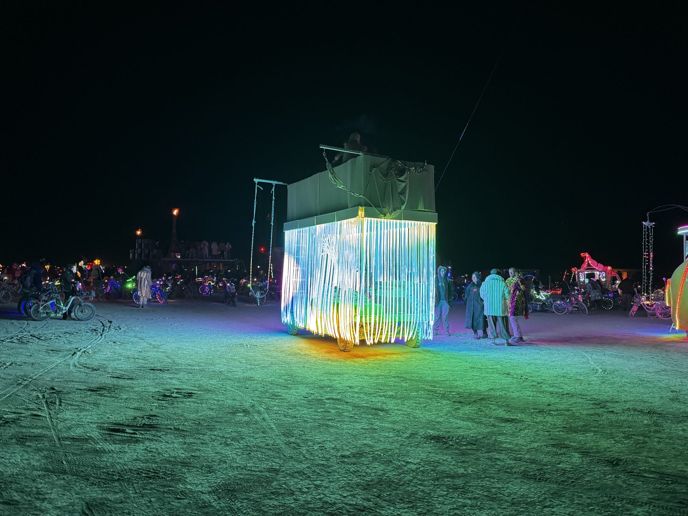](glorb-2026-3522.jpg)

A wide nighttime view of the illuminated car, with green and blue light spilling across the ground.

### 3523 — Wide corner view

[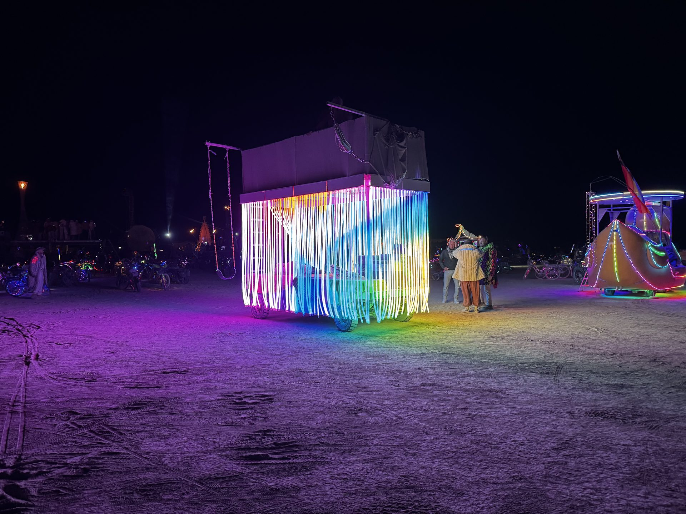](glorb-2026-3523.jpg)

A wider corner view with rainbow-lit tubes and purple light across the foreground.

### 3526 — Blue and cyan

[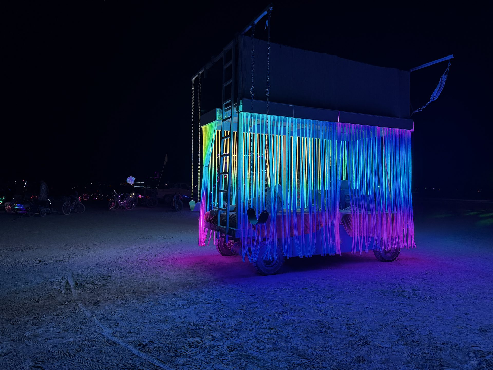](glorb-2026-3526.jpg)

A corner view with blue and cyan bristles and the ladder along the left edge.

### 3527 — Around the ladder

[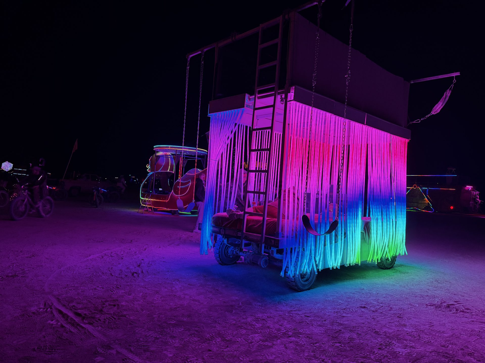](glorb-2026-3527.jpg)

The ladder side, framed by pink tubes above blue and green tips.

### 3528 — Ladder-side glow

[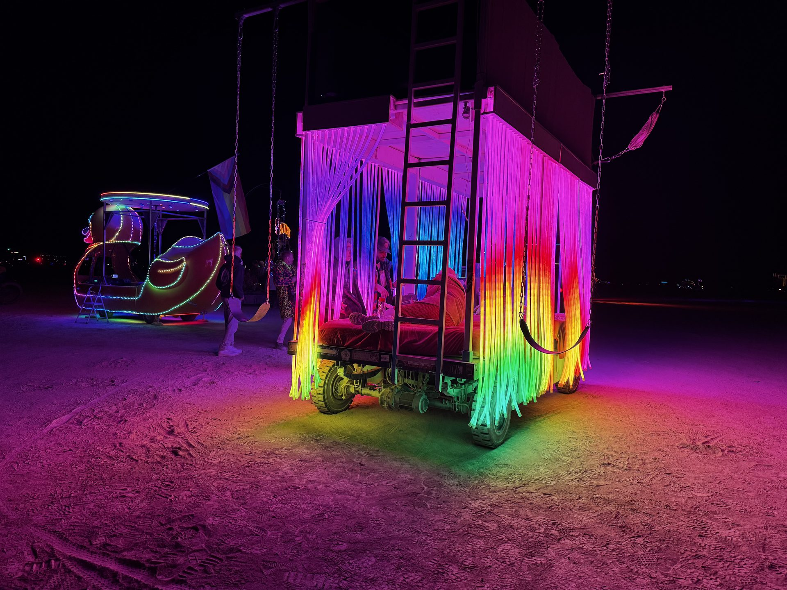](glorb-2026-3528.jpg)

A more direct ladder-side view with pink, yellow and green light around the opening.

### 3529 — The open side

[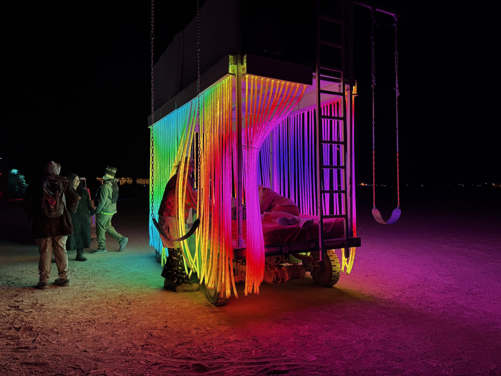](glorb-2026-3529.jpg)

An open-side corner view, with rainbow tubes gathered beside the platform and people nearby.

### 3530 — Magenta bristles

[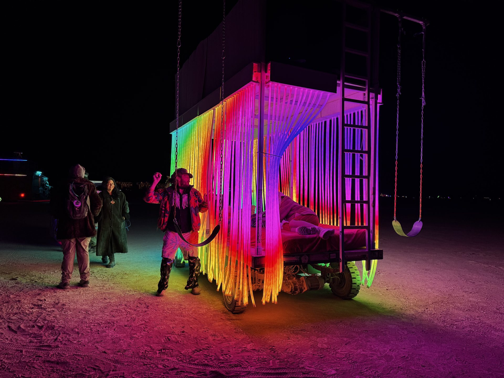](glorb-2026-3530.jpg)

The open-side view with magenta light across the upper bristles and warm light near the ground.

### 3531 — Rainbow wave

[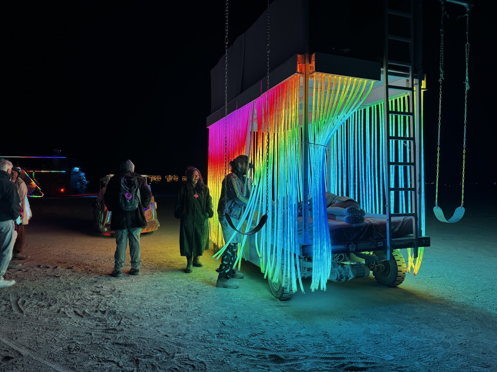](glorb-2026-3531.jpg)

A rainbow wave across the hanging tubes, with the ladder and open platform visible at the right.

### 3532 — Cyan and white

[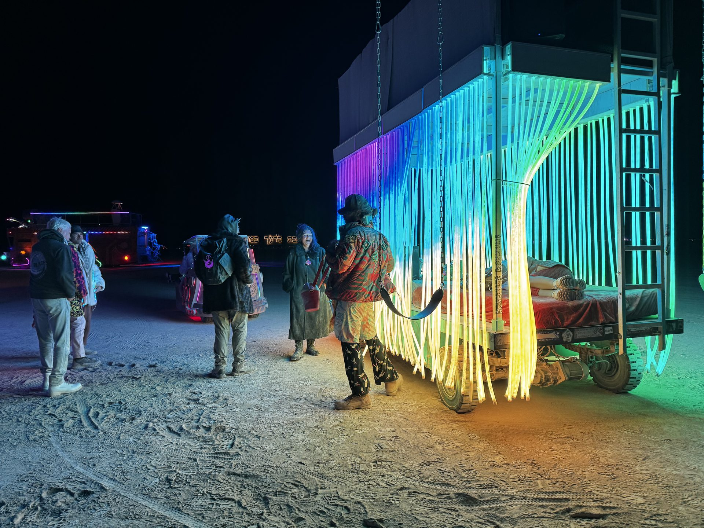](glorb-2026-3532.jpg)

Cyan and white bristles lighting the open-side view and the ground beside the car.

## Source, credit and publication notes

- **Credit:** photos supplied by the project owner; photographer not specified. No photographer attribution or new media license is implied.
- **Collection label:** “Glorb 2026,” as supplied by the owner. This is not independent verification of capture dates, an event itinerary or attendance. Captions describe visible details rather than inferring identities or a location from metadata.
- **Coverage:** the supplied archive contains 12 HEIC stills, 12 MP4 clips and 2 MOV clips. All stills are represented; video originals and HEIC originals are not committed. No animation is needed to browse the still-photo gallery.
- **Web copies:** JPEG, maximum edge 1,920 px, quality 82, progressive encoding. Orientation is applied before conversion; fresh pixel-only copies omit EXIF, GPS, XMP and ICC metadata. Originals remain unchanged outside this repository.
- **Provenance:** [manifest.json](manifest.json) maps original basenames to outputs and records SHA-256 hashes, source sizes, oriented source dimensions, output dimensions and sizes, and conversion settings. It contains no personal archive paths or capture metadata. Unpublished video entries retain only basenames, sizes and hashes.

## Rebuild and verify

Requires Python 3.11+ and the versions recorded in the manifest:

```sh
python -m pip install Pillow==12.3.0 pillow-heif==1.7.0
python docs/gallery-2026/build_gallery.py /path/to/owner-supplied.zip --work-dir /path/to/new-extraction-directory
python docs/gallery-2026/verify_gallery.py
```

Run from the repository root. The extraction directory must be new and outside the repository, with enough space for the full archive. The build writes JPEGs and the manifest here, and a labeled contact sheet only in the extraction directory. Re-encoding under different library versions may change hashes. Captions are manually reviewed, not generated from EXIF.
