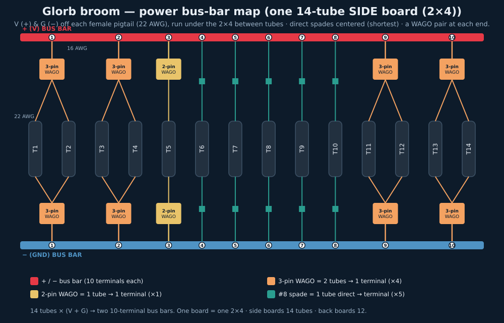
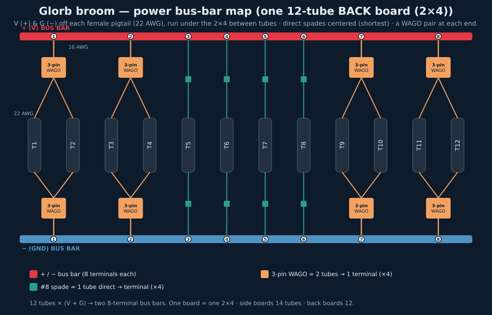

# Power bus-bar map — per 2×4 board

> **Generated by [bus_bar_map.py](bus_bar_map.py) — do not hand-edit.** Change `SECTIONS` and re-run.

Each **2×4 hanger board = one section = one +/− bus-bar pair** (one SRx4 receiver per board too — see [../lights/controllers.md](../lights/controllers.md)). Every free-hanging tube feeds **V (+)** and **G (−)** off its female pigtail (22 AWG) to the bus bars; **data goes separately** to the receiver. **Side boards carry 14 tubes, back boards 12.** The + bus takes the V wires, the − bus the G wires — identical scheme on both.

## One 14-tube side board (2×4)

| Terminal | Connector | Tubes | Into connector | To bus |
| ---: | --- | --- | --- | --- |
| **1** | 3-pin WAGO | T1, T2 | 2× 22 AWG | 16 AWG jumper |
| **2** | 3-pin WAGO | T3, T4 | 2× 22 AWG | 16 AWG jumper |
| **3** | 2-pin WAGO | T5 | 1× 22 AWG | 16 AWG jumper |
| **4** | #8 spade | T6 | 1× 22 AWG | #8 spade crimp (22–16 AWG) |
| **5** | #8 spade | T7 | 1× 22 AWG | #8 spade crimp (22–16 AWG) |
| **6** | #8 spade | T8 | 1× 22 AWG | #8 spade crimp (22–16 AWG) |
| **7** | #8 spade | T9 | 1× 22 AWG | #8 spade crimp (22–16 AWG) |
| **8** | #8 spade | T10 | 1× 22 AWG | #8 spade crimp (22–16 AWG) |
| **9** | 3-pin WAGO | T11, T12 | 2× 22 AWG | 16 AWG jumper |
| **10** | 3-pin WAGO | T13, T14 | 2× 22 AWG | 16 AWG jumper |

**Per bus bar:** 4× 3-pin WAGO + 1× 2-pin WAGO + 5× direct spade = **10 terminals**, serving **14 tubes**. BOM per board (×2 for + and −): 8× 3-pin WAGO, 2× 2-pin WAGO, 10× #8 spade, 10× 16 AWG jumpers, 2× ≥70-A bus bar.

## One 12-tube back board (2×4)

| Terminal | Connector | Tubes | Into connector | To bus |
| ---: | --- | --- | --- | --- |
| **1** | 3-pin WAGO | T1, T2 | 2× 22 AWG | 16 AWG jumper |
| **2** | 3-pin WAGO | T3, T4 | 2× 22 AWG | 16 AWG jumper |
| **3** | #8 spade | T5 | 1× 22 AWG | #8 spade crimp (22–16 AWG) |
| **4** | #8 spade | T6 | 1× 22 AWG | #8 spade crimp (22–16 AWG) |
| **5** | #8 spade | T7 | 1× 22 AWG | #8 spade crimp (22–16 AWG) |
| **6** | #8 spade | T8 | 1× 22 AWG | #8 spade crimp (22–16 AWG) |
| **7** | 3-pin WAGO | T9, T10 | 2× 22 AWG | 16 AWG jumper |
| **8** | 3-pin WAGO | T11, T12 | 2× 22 AWG | 16 AWG jumper |

**Per bus bar:** 4× 3-pin WAGO + 4× direct spade = **8 terminals**, serving **12 tubes**. BOM per board (×2 for + and −): 8× 3-pin WAGO, 8× #8 spade, 8× 16 AWG jumpers, 2× ≥60-A bus bar.

## Layout rule (both boards)

Wires run **under the 2×4, between the tubes**; terminal order matches the rail: **direct #8-spade tubes centered** (shortest runs), **3-pin WAGO pairs at each end**, and — on the 14-tube side board only — the **2-pin WAGO between the left WAGOs and the spades**.

## Notes

- **Build order:** strip V & G on each female pigtail → pair tubes into WAGOs / crimp spades → land all terminals on each bus.
- Data is **separate**: each tube's data wire splices to a 20 AWG extension (marine butt connector) back to the SRx4 receiver — see [../lights/controllers.md](../lights/controllers.md) and [led-wiring.md](led-wiring.md).
- **11 boards for the car:** 8 side boards × 14 tubes = 112 + 3 back-style boards × 12 = 36 → **148 tubes** (zones A, B, D, E are 2 side boards each; C is 2 back boards; **F is 1 front-right board**, added 2026-08).
