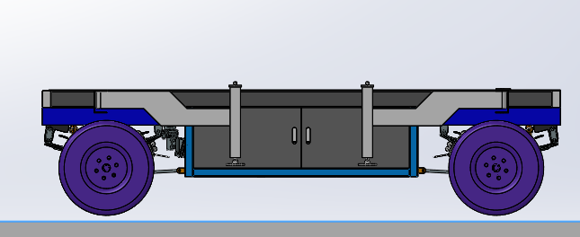
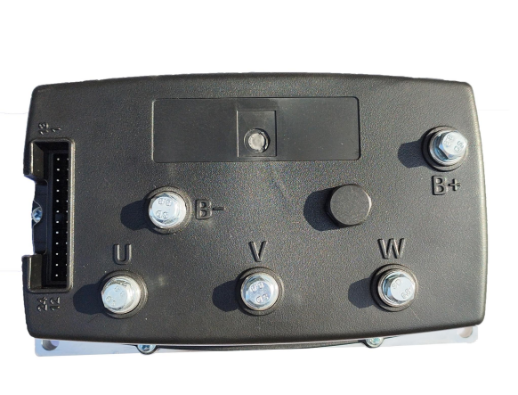
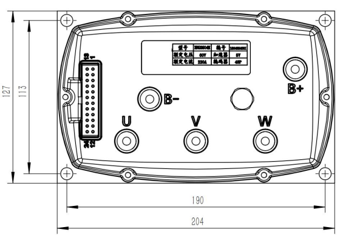
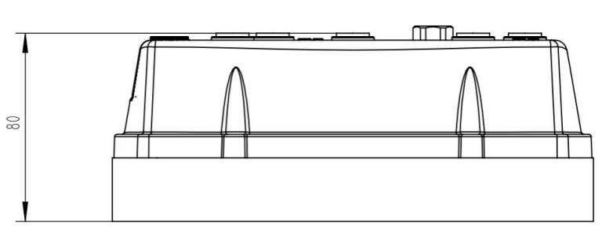
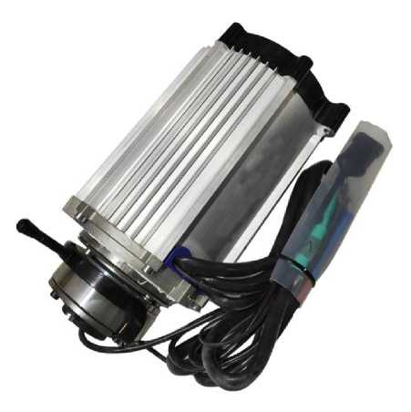
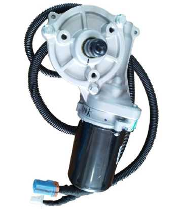
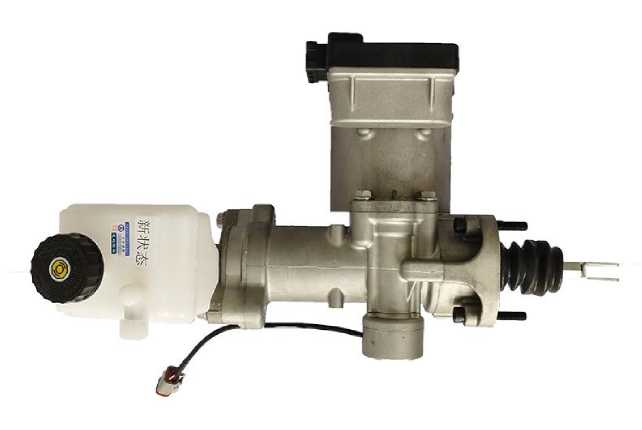
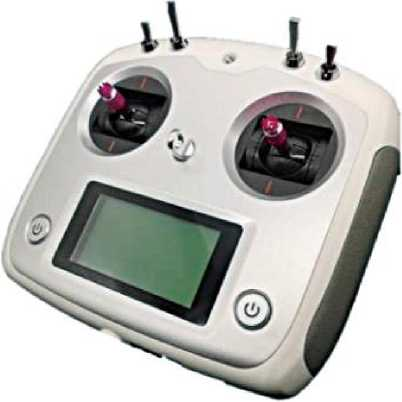
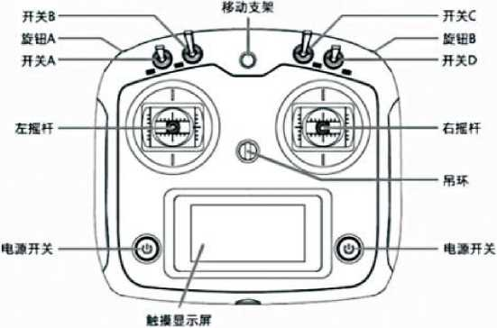
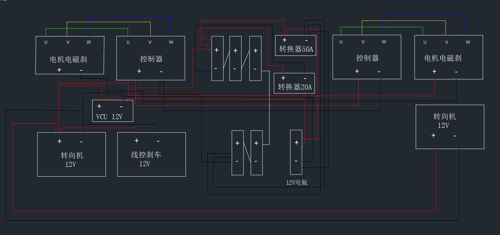

# Drive-by-wire chassis — instruction manual (English translation)

English translation of the Chinese instruction manual for Glorb's drive platform —
the **"4WD 500M Remote Control Transport 72V"** electric four-wheel drive-by-wire
chassis (see [../../logistics/stuff.md](../../logistics/stuff.md)). Original file:
[manual-zh-original.docx](manual-zh-original.docx) · rendered PDF of this
translation: [manual-en.pdf](manual-en.pdf).

Manufacturer: **Fengxian Zhonglian Electric Technology Co., Ltd.** (丰县众联电动科技有限公司),
D3 Steel City, Beiguan, Feng County, Xuzhou, Jiangsu, China. Contact: Manager Bu (卜经理), +86 153 3513 2286.

> **Translation notes.** Several pages of the original are low-resolution scans;
> numbers that were hard to read are marked *(?)*. Section numbering follows the
> original (it starts at "I. Function introduction" — the warranty card and
> troubleshooting table come before it, unnumbered). Original scanned tables are
> kept in [img/](img/) alongside the translations.

**Quick pointers for Glorb debugging:**

- The **beeping fault codes** from the motor controllers are in
  [§ IV](#iv-drive-controller-fault-codes) — count the long and short beeps.
- Per [§ III](#iii-wiring-and-pairing) and the wiring diagram, the **VCU
  (the control box the drone-style receiver plugs into), EPS steering, and EBS
  brakes all run on 12 V**, fed from the 60 V traction bus through DC-DC
  converters (50 A and 20 A). Each drive controller's key-switch wire (purple)
  and brake-signal wire (blue) get 60 V+ from the VCU.
- Remote pairing/troubleshooting is in the [troubleshooting table](#troubleshooting)
  and [remote operation](#remote-control-operation).

---

## Cover

**INSTRUCTION MANUAL (使用说明书)**
**Electric four-wheel drive-by-wire chassis (电动四轮线控底盘)**

*(Cover art: "Explore · Pioneer" — preserved in the original docx.)*

## Warranty information

**User information:** product model · purchase date · customer name.

**Warranty record:** warranty date · cause of fault and resolution · handler's signature · customer confirmation.

### Warranty terms

1. When purchasing this product, fill in this card carefully and read the
    warranty terms below to ensure effective warranty coverage:
    - Keep this card safe when purchasing, and have the seller stamp it to confirm.
    - This warranty card must be presented when requesting warranty service.
    - The information on this card must be truthful, otherwise it is void.
    - The warranty period is **one year**. If the product fails during the
     warranty period due to defective components or manufacturing problems, the
     company provides free repair and parts replacement.
2. Damage from the following causes is **not** covered by the warranty:
    - Damage caused by installation or use not in accordance with this manual.
    - Any man-made or accidental damage.
    - Repairs or modifications not approved by the company, or a broken warranty seal sticker.
    - Aging, dents, or scratches of the product's outer housing.

## Troubleshooting

| Symptom | Check | Remedy |
| --- | --- | --- |
| **Steering / brakes have no power** | Is the power connected incorrectly? | Check that the power-wire input and output ends are correct |
| | Are the ports loose, or has a power wire fallen off? | Reconnect the power wire and tighten the terminal screws |
| **Remote range is short, or remote does not work** | Is it being operated next to strong magnetic fields or high-power electrical equipment? Are there too many obstructions between the control box and the transmitter? | Install the controller at least 0.5 m from high-power / strongly magnetic equipment; clear obstructions between the control box and the transmitter |
| | Was a CAN wire or power wire accidentally knocked loose? | Power-cycle the remote and the control box, and check the power supply |
| **Buttons feel obstructed when pressed** | — | Check the gap between the button and the panel for trapped debris, and clear it promptly |
| **Remote transmitter cannot be used at all** | Not yet paired with the control box | Re-pair the transmitter with the control box (see the pairing instructions on page 2 — the [remote control operation](#remote-control-operation) section) |
| | Buttons fallen off or damaged | Replace or send for repair |

## I. Function introduction

The four-wheel-drive, dual-steering drive-by-wire vehicle has high
obstacle-crossing capability, with all four wheels driven simultaneously. It
receives signals over the **CAN bus** to control forward / reverse / steering /
braking. The product can be paired with multiple wireless control panels for
flexible multi-controller operation. The body uses a compact design and is easy
to operate.

## II. Product components / technical specifications

### AC drive controller

Nameplate (from the dimension drawing): rated voltage **60 V**, rated current
**220 A**, throttle input **5 V**, encoder **48 P**.

Dimensions: 204 × 127 × 80 mm overall; mounting holes 190 × 113 mm.

Notes from the drawing:

1. **B+** connects to battery positive, **B−** to battery negative; **U, V, W**
    connect to motor U, V, W respectively.
2. U/V/W motor cables and battery cables: 20 mm² cross-section.
3. Terminal posts are secured with M6×20 bolts, torqued to 6–10 N·m.
4. The motor controller complies with GB/T 18488.1-2015 and GB/T 18488.2-2015
    (Chinese EV drive-motor standards).
5. Untoleranced dimensions per GB/T 180-M.
6. All terminal directions shown in the drawing are the wire-entry direction.

#### CAN protocol (data format)

Original scan: [img/can-protocol-zh.png](img/can-protocol-zh.png)

**Frame 1 — ID `0x1A0`: vehicle controller (TCU) → motor drive (MCU), speed control frame, period 100 ms**

| Byte | Field | Definition |
| --- | --- | --- |
| 1 | Motor enable state | `0x00`: disabled · `0xA5`: enabled |
| 2 | Switch (gear) info | `0x00`: neutral · `0xAA`: forward · `0x55`: reverse · `0x88`: brake |
| 3–4 | Target speed | 0–6000 rpm, high byte last |
| 5–6 | — | — |
| 7–8 | `0x7889` | Message identification, high byte last |

**Frame 2 — ID `0x1B0`: MCU → all, feedback frame, period 100 ms**

| Byte | Field | Definition |
| --- | --- | --- |
| 1–2 | Motor speed | offset −10000, 1 rpm/bit, high byte last |
| 3–4 | Motor current | 1 A/bit |
| 5 | Alarm code | see [§ IV](#iv-drive-controller-fault-codes) |
| 6 | Controller temperature | 1 °C/bit, offset −40 |
| 7 | Motor temperature | 1 °C/bit, offset −40 *(scan reads "−41")* |
| 8 | Driving-state flag | `0x00`: manual (RC) control · `0xA5`: CAN control |

**Frame 3 — ID `0x00`:** reserved — do not use this ID for anything else.

### AC motor with electromagnetic brake

Motor model **JS-YS140-H22** — rated DC 60 V, 2.2 kW, 4 poles, insulation class
H, protection rating IP55. Output spline: 18 teeth, module 1, pressure angle
30°, major Ø19.5 mm, minor Ø17.11 mm. ([Original parameter scan](img/motor-params-zh.jpeg),
[dimension drawing](img/motor-dims.jpeg).)

Dynamometer characteristic points *(low-quality scan — treat digits as approximate)*:

| Point | V | A | Input kW | Torque N·m | rpm | Output kW | Eff. % | Time s |
| --- | --- | --- | --- | --- | --- | --- | --- | --- |
| No load | 62.7 | 32.3 | 2.03 | 0 | 4514 | 0 | 0 | 0 |
| Rated | 62.3 | 38.3 | 2.39 | 4.74 | 4475 | 2.22 | 93.1 | 8 |
| Max efficiency | 62.3 | 38.3 | 2.39 | 4.74 | 4475 | 2.22 | 93.1 | 6 |
| Max output | 61.4 | 198.8 | 12.21 | 48.42 | 1418 | 7.19 | 58.9 | 64 |
| Max torque | 62.6 | 155.7 | 9.75 *(?)* | 55.66 | <402 | 2.34 | 24 | 76 |
| End | 62.6 | 155.7 | 9.75 *(?)* | 55.66 | 0 | 0 | 0 | 76 |

Electrical connectors ([original scan](img/motor-connectors-zh.jpeg)):

- **Black 4-pin connector — speed sensor** (HMEX67Q003 *(?)*), plug DJ7041-1.5:
  pin 1 V+ (red) · pin 2 signal B (green) · pin 3 signal A (white) · pin 4
  ground (black). The sensor outputs **48 pulses per revolution**.
- **Black 2-pin connector — temperature feedback**, plug DJ7021-1.5: pin 1 "+"
  (red) · pin 2 "−" (black). Sensor: **KTY84-150**.

### EPS (electric power steering)

| Parameter | Value |
| --- | --- |
| Product | EPS assembly, steering-column type |
| Working current | 65 A max |
| Motor torque | 3.4 N·m |
| Reduction ratio | 1 : 17 |
| Working temperature | −40 … 105 °C |
| Working voltage | 12 V nominal (9–16 V) |
| Relative humidity | 93 % (500 h) @ 40 °C |
| Spline-to-spline distance | 178 mm |
| Input spline | 40 teeth (module 0.4722, Ø19.3) |
| Output spline | 36 teeth (module 0.47, Ø17.3) |

Drawings: [EPS dimensions](img/eps-dims.jpeg) ·
[EPS ECU photo](img/eps-ecu-photo.jpeg) ·
[ADAS EPS-ECU wiring & protocol sheet](img/eps-ecu-wiring-zh.jpeg) *(scan too
low-resolution to translate in full; it is the ECU's connector/pin sheet)*.

### EBS (electronic brake booster)

| Parameter | Value |
| --- | --- |
| Product | Electronic brake booster assembly, model **EBS-15T (A)** |
| Weight | 7.5 kg |
| Mounting envelope | 345 × 253 × 197 mm |
| Application | vehicles < 1.5 t (speeds ≥ 60 km/h *(?)*), max boost 5.2 kN *(?)*; vehicles ≤ 4 t at ≤ 40 km/h if matched to caliper displacement, max boost 5.2 kN *(?)* |
| Master cylinder | plunger-type tandem dual-chamber, ports ISO M10×1.0, bore Ø20.64 mm, effective stroke 19 + 19 mm |
| Pedal rod | optional with or without, per customer requirement |
| Working temperature | −40 … 105 °C |
| Working voltage | 12 V nominal (10–14 V) |
| Motor rated power | 200 W typical, 500 W max *(?)* |
| Bus current | 20 A typical; stall current higher *(digits unreadable)* |
| Max output pressure | 10–14 MPa *(?)* |
| Pressure build time (10→90 %) | 150 ms |
| Pressure release time (90→10 %) | 100 ms |

Drawings: [front](img/ebs-dims-front.jpeg) · [side](img/ebs-dims-side.jpeg) · [top](img/ebs-dims-top.jpeg)

#### EBS alarm codes (bit field)

Original scan: [img/ebs-alarm-bits-zh.png](img/ebs-alarm-bits-zh.png)

| Bit | Fault | Code | Notes |
| --- | --- | --- | --- |
| 0 | Undervoltage | 01 | transient voltage too low |
| 1 | Overload | 02 | |
| 2 | Overvoltage | 04 | transient voltage too high |
| 3 | U-phase fault | 08 | |
| 4 | V-phase fault | 10 | |
| 5 | W-phase fault | 20 | |
| 6 | Overcurrent | 40 | |
| 7 | Stall protection | 80 | |
| 8 | IPM fault | 01 | drive fault |
| 9 | CAN timeout | 02 | communication timeout |
| 10 | Self-learning fault | 04 | magnetic-pole learning fault |
| 11 | 12 V supply fault | 08 | sustained abnormal supply voltage (over- or undervoltage) |
| 12 | Self-check fault | 10 | sensor / MCU RAM / ROM self-check (internal program check) |
| 13 | busoff | 20 | reserved |
| 14 | Reserved | 40 | |
| 15 | Ignition-signal fault | 80 | ignition signal disconnected |

## Remote control operation

Layout diagram labels (clockwise from top): phone/mobile mount (top center),
switch B and switch C (inner toggles), switch A and switch D (outer toggles),
knobs A and B, left stick, right stick, lanyard ring (center), touch display
(bottom center), and **two power switches** (bottom left + bottom right).

**Power-on:**

1. Press **both power switches at the same time** to turn the transmitter on.
2. Flip **all toggle switches to the up position**; when the display shows
    "flight mode off" (飞行模式关闭), the remote is ready to use.

**Switch functions:**

| Switch | Position | Function |
| --- | --- | --- |
| A | up | normal remote-control mode |
| A | down | host-computer **CAN control mode** (drive commands come from an upstream computer instead of the sticks) |
| B | up | forward |
| B | middle | neutral |
| B | down | reverse |
| C | up | turn on switched output 1 |
| C | middle | turn off switched outputs 1 and 2 |
| C | down | turn on switched output 2 |
| D | up | turn off switched output 3 |
| D | down | turn on switched output 3 |

## III. Wiring and pairing

Wiring-diagram blocks (translated): 电机电磁刹 = motor with electromagnetic
brake (×2, U/V/W phases) · 控制器 = drive controller (×2) · VCU 12V = vehicle
control unit · 转向机 12V = steering motor / EPS (×2) · 线控刹车 12V =
brake-by-wire / EBS · 转换器50A / 转换器20A = 50 A and 20 A DC-DC converters ·
center columns = traction battery bank · 12V电瓶 = 12 V battery.

1. **+** connects to battery positive, **−** to battery negative; controller
    **U, V, W** connect to motor **V, U, W** respectively *(sic — the wiring
    note swaps U and V here, while the controller drawing says U→U, V→V, W→W;
    follow whatever the vehicle is actually wired as)*.
2. The steering **EPS**, brake **EBS**, and **VCU** each take one set of 12 V
    positive and negative from the **12 V supply**; the EPS and EBS **ignition
    wires** also connect to 12 V+.
3. All **CAN H** lines of the EPS, EBS, VCU, and drive controllers connect
    together to CAN H, and all **CAN L** lines to CAN L.
4. All drive-controller positives connect to **60 V+**, all negatives to **60 V−**.
5. Each drive controller's **key-switch wire (purple)** and **brake-signal wire
    (blue)** connect to **60 V+ on the body controller** (the VCU control box).

*(Pairing the transmitter to the control box: see the power-on procedure in
[remote control operation](#remote-control-operation); the troubleshooting
table calls this "pairing". The transmitter/receiver pair is a FlySky-style
2.4 GHz RC system — if a full re-bind is ever needed, use the standard bind
procedure for the transmitter model on the receiver inside the control box.)*

## IV. Drive controller fault codes

The drive controller signals faults as **audible beep patterns** ("one long,
two short" = 1 long beep followed by 2 short beeps, repeating). Original scan:
[img/fault-codes-zh.png](img/fault-codes-zh.png)

| Code | Beeps | Fault | Cause / analysis |
| --- | --- | --- | --- |
| #0011 | 1 long, 1 short | Overvoltage protection | battery voltage does not match controller |
| #0012 | 1 long, 2 short | Undervoltage protection | battery voltage does not match controller |
| #0013 | 1 long, 3 short | Capacitor-board low voltage | battery voltage low, or controller fault |
| #0014 | 1 long, 4 short | Power-module short circuit | controller fault |
| #0015 | 1 long, 5 short | Chip fault | controller fault |
| #0016 | 1 long, 6 short | Current sensor 1 fault | controller fault |
| #0017 | 1 long, 7 short | Current sensor 2 fault / current calibration / customization fault | controller fault |
| #0019 | 1 long, 9 short | CAN communication fault | — |
| #0021 | 2 long, 1 short | Throttle fault | throttle reading high / mismatched, or throttle needs reset |
| #0022 | 2 long, 2 short | Gear protection | reset gear selection to neutral |
| #0023 | 2 long, 3 short | Simultaneous throttle and brake request | brake signal mismatched or wrong signal threshold |
| #0024 | 2 long, 4 short | Charging protection alarm | disconnect the charging plug |
| #0025 | 2 long, 5 short | Simultaneous forward and reverse signals | gear wiring error |
| #0026 | 2 long, 6 short | Encoder fault | — |
| #0027 | 2 long, 7 short | Encoder signal lost | — |
| #0031 | 3 long, 1 short | Circuit supply | **key-switch poor contact** |
| #0032 | 3 long, 2 short | Phase-wire overcurrent protection | three-phase wiring poor contact, encoder unstable, or motor phase short |
| #0033 | 3 long, 3 short | Controller over-temperature protection | let it cool, move to a better-ventilated location, or add heatsinking |
| #0034 | 3 long, 4 short | Motor over-temperature protection | let it cool, or fit a higher-power motor |
| #0035 | 3 long, 5 short | Temperature-sensor fault or low-temperature protection | stops working below −25 °C |
| #0051 | — | Overcurrent protection | phase-wire or supply short circuit |
| #0052 | — | Overcurrent protection | phase-wire or supply short circuit |
| #0053 | — | Overcurrent protection | phase-wire or supply short circuit |

## V. Safety notes

- Install and operate this product strictly according to this manual. Operators
  must have basic electrical knowledge, and should work **with power
  disconnected** to avoid electric shock.
- The vehicle's electronic control components must be installed in a dry
  environment free of flammable or explosive gases. Never use this product in
  damp conditions or scenarios without any protective measures.
- The product's applicable supply voltage is AC 48 V–220 V *(sic — this line
  appears to refer to the charger input)*; connecting a supply outside this
  range will damage the product.
- If the housing is damaged, or the product emits abnormal noises or smells
  during use, stop using it immediately and repair or replace it.

---

*Back cover:* PRODUCT SPECIFICATION (产品说明书) — "Providing excellent service
is our mission; what we bring customers is never just an excellent product."
Fengxian Zhonglian Electric Technology Co., Ltd., D3 Steel City, Beiguan, Feng
County, Xuzhou, Jiangsu · Manager Bu, +86 153 3513 2286.
