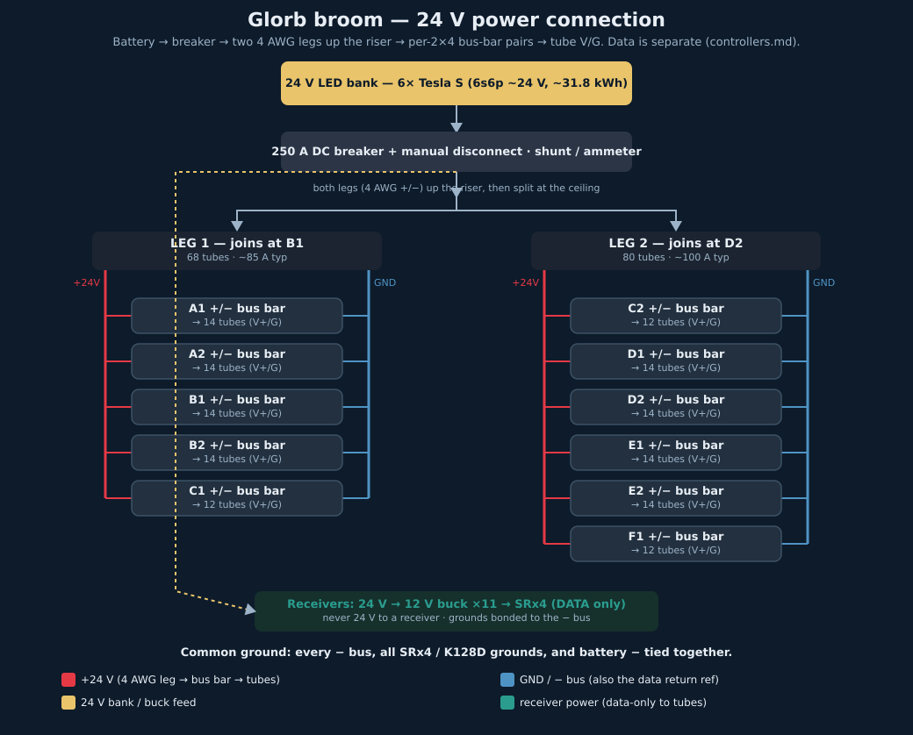

# Broom LED tube — power wiring & disconnect

Physical power wiring for the **148 × 2.5 m SM16703 tubes** ([../broom/DESIGN.md](../broom/DESIGN.md)) on the 24 V bus. Data wiring is separate — see [../lights/controllers.md](../lights/controllers.md). Power source (which battery bank) is decided in [led-power.md](led-power.md); this doc assumes a single 24 V feed point at the battery.

## Load & geometry (from DESIGN.md / dimensions.md)

- **Perimeter (open-front U):** 11.6 m ≈ **38 ft**. Sides ~4 m each (L01–L56, R01–R56), back ~1.7 m (B01–B24).
- **Currents @ 24 V, 148 tubes** (scaled ~+9% from the 136-tube figures in [led-power.md](led-power.md)): idle ~62 A · typical chase **~185 A** · 30%-white all-lit ~204 A · full-white solid **~454 A** (firmware-capped to bursts).

## Topology — split at the battery, both legs share the riser

> ✏️ **Re-routed 2026-07-28.** Batteries are in the **bottom of the car**; all trunk runs use the **existing wire coverings**: up the **middle-right pole** (riser), **across the ceiling** middle-right → middle-left, along **both ceiling sides**, and across the **back-right portion only** of the back.

Split into two trunk pairs at the breaker (bottom, at the battery), run **both pairs up the riser together**, then part ways at the ceiling. **Leg assignment is by 2×4 board (updated 2026-08):**

- **Leg 1 — joins at board B1** (left side + back-left): powers **A1, A2, B1, B2, C1** — tubes `L01–L56` + `B01–B12`.
- **Leg 2 — joins at board D2** (right side + back-right + front-right F): powers **C2, D1, D2, E1, E2, F1** — tubes `B13–B24` + `R01–R56` + `F01–F12`.

> Each leg stays on its own side of the car — no crossing drops. The legs are **not** 50/50: **Leg 1 = 5 boards / 68 tubes (~85 A typical); Leg 2 = 6 boards / 80 tubes (~100 A typical)** — both comfortably within 4 AWG. Leg 2 also feeds the new **F1** front-right board (`F01–F12`).



*Generated by [power_map.py](power_map.py). The ASCII below is the physical routing sketch.*

```
 front-left ◄──── left leg ────► back-left      (left ceiling covering)
                    ▲
                    │  ceiling crossing (mid)
                    ▼
 front-right ◄─── right leg ───► back-right ─► mid-back bar ─► B24…B01
                    ▲                          (back-right covering; B01–B12
                    │  riser: middle-right      on long uncovered drops)
                    │  pole, both pairs
           [BREAKER/DISCONNECT]
                    │
              BATTERY +/-  (bottom of car)
```

Why still split at the battery even though both legs share the riser: each leg carries **~85–100 A typical instead of the full ~185 A**, so the trunk stays **4 AWG** instead of one stiff 2/0 run, and a fault on one leg doesn't dark the whole car.

**Run lengths (estimates — verify on the car):** riser ~8 ft, ceiling crossing ~6 ft, half-side ~6.5 ft, back-right covering ~3 ft. Longest branch (left leg backward, or right leg to mid-back) ≈ **20 ft one-way**.

## Disconnect + protection

One **DC circuit breaker with manual switch lever, 250 A, DC-rated ≥32 V**, at the battery (bottom of car) on the main **+** feed *before* it splits into the two legs — location confirmed 2026-07-28. Single part = daytime "kill the LEDs" disconnect **and** wire protection. Kill it → both legs dark.

- ⚠️ **The originally-ordered 150 A breaker is undersized for 136 tubes** — typical chase is now 170 A and would trip it. **Reorder at 250 A** (170 A typical = 68% of rating, no nuisance trips; a runaway full-white command at 417 A still trips it — a useful hardware backstop, since brightness is firmware-capped anyway).
- Want sustained full white? That's 417 A — needs a bigger breaker **and** 2/0-class legs; not planned.

## Wire gauge & voltage drop

**Trunk: 4 AWG per leg** (tinned/marine for BRC dust). Drop for the ~20 ft worst branch (riser + crossing carry the full leg current with no taps; the ceiling section tapers as tubes tap off):

| Load | Amps/leg | Drop (4 AWG, worst branch) | % of 24 V |
| --- | ---: | ---: | ---: |
| Typical chase | 85 A | ~0.7 V | 3% |
| 30%-white all-lit | 94 A | ~0.8 V | 3.3% |
| Full-white burst | 208 A | ~1.7 V | 7% |

4 AWG marine ≈ 150 A continuous: 94 A sustained loafs; the 208 A full-white burst is **over** continuous rating and relies on the firmware cap keeping it brief. If sustained full-white ever becomes a requirement, bump legs to **2 AWG**. (6 AWG is no longer a viable lighter alternative at these currents.)

At 24 V, drop is still not the constraint. Even on the 18–25 V Tesla 6p bank ([led-power.md](led-power.md)), the far tube stays ~16 V worst case — well above the SM16703's ~10–12 V constant-current dropout.

**Per-tube drops: 18 AWG.** Each tube pulls max ~3 A (full white) / ~1.3 A typical. With a +/− bus-bar pair on each 2×4 board (below), each drop is short (≤ ~0.7 m).

## Tube connections — tiered trunk + per-board bus bars

Don't tap the 4 AWG trunk 148 times. 4 AWG is a big heat-sink (hard to solder) and T-tap/IDC connectors top out around 10–12 AWG. Instead, two tiers:

- **4 AWG trunk stays continuous** along the ceiling coverings, two legs (split at battery).
- Each **2×4 board gets one +/− bus-bar pair** — land the trunk leg on the bar's two main studs so it passes the leg current through. **11 boards → 22 bars** (8 side + 3 back-style). See **[bus-bar-map.md](bus-bar-map.md)** for the per-board terminal layout.
- Each tube's **V/G drops (18 AWG) land on #8 screws** on its board's bus-bar pair — some pairs consolidated through 3-pin WAGOs (see the bus-bar map).

Only the ~22 lugged bus-bar landings are heavy joints — **no soldering to 4 AWG** — and the ~296 tube connections become serviceable **screw terminals**, good for dust/vibration.

**Bus-bar sizing:** bars nearest the riser pass the full leg current (Leg 2 ~100 A typical, ~245 A full-white burst) → use **≥150 A rated** bars there; downstream bars can be lighter. **Fused distribution blocks** per board are a nice optional upgrade so one board short doesn't drop the whole leg.

## Routing — existing coverings (power + data together)

Both the 4 AWG power trunk and the tube data lines share the coverings (riser, ceiling crossing, ceiling sides, back-right):

- Run **only the data wire** to each tube — V/G come from the bus bars — as a **20 AWG extension** butt-spliced (marine) to the tube's female pigtail, back to the nearest **SRx4**. The tube's ground reference is the − bus, so **bond every SRx4 / K128D-B ground to the − bus** (shared-ground requirement, [../lights/controllers.md](../lights/controllers.md)).
- **Power the receivers locally, never at 24 V.** Each SRx4 takes **5–13 V** on its power lugs (use a 12 V buck off the 24 V bus, one per 2×4 board) — the cat5 from the K128D carries data only. On the 3-pin receiver outputs use **D + G**; leave **V unconnected** (landing V on a 24 V tube back-feeds the board). See [../lights/controllers.md](../lights/controllers.md).
- Give the data lines a few cm of separation from the high-current trunk over long parallel runs to keep switching noise off the signal. It's DC so coupling is mild; the DIN series resistor + short data pigtail at each tube matter more.

## Feet needed

- **4 AWG trunk:** right leg ≈ 24 ft/conductor (riser 8 + fwd 6.5 + back 6.5 + back-right 3), left leg ≈ 26.5 ft/conductor (riser 8 + crossing 6 + fwd 6.5 + back 6.5) → **~50 ft per color before slack or battery jumpers**. The 50 ft red + 50 ft black on hand has **zero slack** — reorder **+25 ft each color** (see [Reorder](#reorder-for-136-tubes)).
- **18 AWG drops:** at 72 mm tube pitch ([../broom/DESIGN.md](../broom/DESIGN.md)) the ~6 in factory leads reach the 2–3 tubes nearest each bar directly; the rest need short drops of a few inches to ~0.4 m. Summed across 11 boards ≈ 30 m total → buy **50 ft red + 50 ft black**. (Densifying to a terminal block every ~3 tubes would let factory leads land direct and drop this to near zero.)

## Board plan — one bus-bar pair per 2×4 (11 boards, 148 tubes)

> ⚠️ **Updated 2026-08:** power injection is organised **per 2×4 board** (11 boards), not the old "~14 injection zones." Full per-board terminal layout (14-tube side / 12-tube back variants): **[bus-bar-map.md](bus-bar-map.md)**.

Split feed, two legs. **One +/− bus-bar pair per 2×4 board** — 8 side boards (14 tubes) + 3 back-style boards (12 tubes: C1, C2, F1) = **11 boards → 22 bars**. Per board, the **+24 V bar** taps the red 4 AWG leg and the **ground bar** taps the black; single-node bars can't mix polarity, so they come in +/− pairs. Each tube's V/G lands on #8 screws (some pairs consolidated through 3-pin WAGOs — see the bus-bar map). Bars nearest the riser pass full leg current, so those are ≥150 A rated.

- **Leg 1 (joins at B1):** boards A1, A2, B1, B2, C1 — 68 tubes.
- **Leg 2 (joins at D2):** boards C2, D1, D2, E1, E2, F1 — 80 tubes.

**Back-left drops (board C1, `B01–B12`):** no covering on the back-left, so those take longer uncovered 18 AWG drops (up to ~0.9 m).

### Reorder for 136 tubes

> **Now 148 tubes / 11 boards** (zone F added) — the 136 column below is historical; add ~one more board's worth of bus bars, caps, and a buck (see [bus-bar-map.md](bus-bar-map.md)).

The 2026-07-16 order was sized for 100 tubes / 10 zones. Going to 136 tubes / 14 zones, these come up short:

| Item | Have | Need (136) | Reorder |
| --- | ---: | ---: | --- |
| Main breaker | 150 A (2-pack) | **250 A** (170 A typical would trip 150 A) | **1× 250 A DC breaker**, manual lever, ≥32 V DC |
| 4 AWG trunk | 50 ft/color | ~50 ft/color + slack/jumpers (new riser route) | **+25 ft red + 25 ft black** |
| Busbars | 22 (11 two-packs) | 28 | **+3 Ampper 2-packs** (→ 28 + 2 spare) |
| Injection caps | 100 (4× 25-pk) | 136 | **+2 Innfeeltech 25-pks** (→ 150, ~14 spare) |
| 18 AWG drops | 50 ft/color | ~68 ft/color | **+1 more 50 ft 18/2** roll |
| 4 AWG ring lugs | 30 | ~60 (2 per bar × 28 = 56 + battery/breaker/split) | **+3–4 TKDMR 10-pks** — recount against final bar count |
| Fork terminals | 400 | 272 | ✅ enough |

Everything else (heatshrink, cable-tie mounts, ammeter) is unaffected.

## Ordered — 2026-07-16 (Amazon, total $624.96)

> Placed 2026-07-16. Everything cross-checked against the zone plan before ordering. Re-verify listings before any reorder — ASINs/prices drift.

| # | Item | Product | Qty | ~Each | Covers |
| --- | --- | --- | ---: | ---: | --- |
| 1 | Disconnect/breaker | Bolipoeq 150 A DC breaker, 12–48 V, IP67, manual reset — 2-pack | 1 | $18.99 | Combined disconnect + main protection on the + feed (spare in the 2-pack) |
| 2 | 4 AWG trunk | TEMCo 50 ft black + 50 ft red, USA pure copper welding cable | 1 | $168.32 | Two trunk legs. Bare copper (not tinned) — accepted |
| 3 | 18 AWG drops | 18/2 bonded 2-conductor, 50 ft, tinned stranded | 1 | $15.50 | Per-tube +24 V / GND drops = 50 ft red + 50 ft black |
| 4 | 4 AWG ring lugs | TKDMR 4 AWG 1/4"/M6 ring lugs + heatshrink, 10-pk | 3 | $7.99 | 30 lugs — battery, breaker, split, + trunk landings on M6 studs |
| 5 | Bus bars | Ampper 150 A marine busbar, 3× M6 studs + 10× #8 screws, w/ cover, red+black 2-pack | 11 | $23.19 | 22 bars = 10 +/− zone pairs + 2 spare. M6 studs = trunk pass-through; #8 screws = tube drops |
| 6 | 18 AWG fork terminals | Teansic 200-pc #8 insulated fork, 22–16 AWG (100 red + 100 black) | 2 | $9.99 | 400 forks for ~200 tube drops. Match the #8 busbar screws — **not ferrules** (bars are screw-down) |
| 7 | Injection caps | Innfeeltech 1000 µF 50 V radial electrolytic, 25-pk | 4 | $6.49 | 100 caps, one per tube. Across +24 V/GND at each tube; polarity matters |
| 8 | Cap heatshrink | NeoWire 3/4" (19.1 mm) 3:1 dual-wall adhesive-lined, 29 ft | 1 | $30.99 | Sleeve + strain-relief over each soldered cap |
| 9 | Cable-tie mounts | 140-pk 3/4" adhesive+screw cable-tie bases (**includes zip ties**) | 1 | $9.99 | Secure trunk every ~250–300 mm around the rail |
| 10 | Ammeter / shunt | CGELE DC monitor meter + shunt, 0–300 A | 1 | $21.59 | On the main before the split — watch real draw, tune firmware cap |

Notes / decisions baked in:
- ~~**Routing: top rail**~~ — superseded 2026-07-28 by the covering route (riser up middle-right pole → ceiling); power trunk + data lines still run together, tubes still inject at the top end.
- **4 AWG is bare copper, not tinned** — accepted the corrosion trade for cost; keep an eye on the lugged joints for playa oxidation.
- **Caps mount at each tube**, soldered across +24 V / GND, sleeved in the 3:1 adhesive heatshrink. Long lead (+) → +24 V, stripe (−) → GND.
- **Fork terminals, not ferrules** — busbars are screw-down (single-node), so #8 forks land under the screws.
- **Ground:** the black-trunk bars are the distributed common ground; tie them, all **SRx4 / K128D-B** grounds, and battery negative together — **shared ground is mandatory** for the data signal (only data runs to each tube; its return reference is the − bus).

## Related

- [led-power.md](led-power.md) — which 24 V bank feeds this (EG4 2s2p vs Tesla module vs DC-DC)
- [../lights/controllers.md](../lights/controllers.md) — data wiring, shared-ground requirement, 1000 µF injection caps
- [../broom/DESIGN.md](../broom/DESIGN.md) — tube count, measured power, perimeter
- [power-budget.md](power-budget.md) — overall cart load budget
