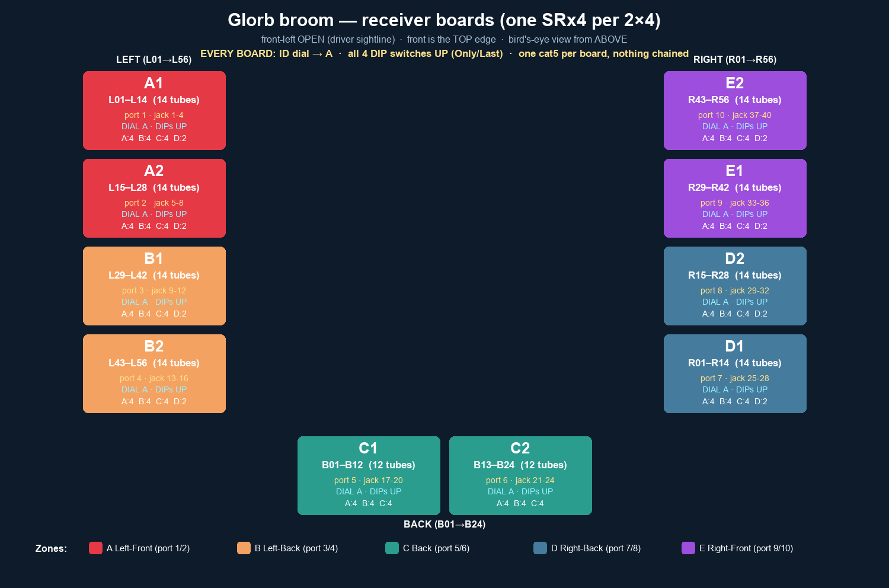

# Broom LED tube map — receivers, outputs, channels

> **Generated by [tube_map.py](tube_map.py) — do not hand-edit.** Change the knobs in that script and re-run.

**136 tubes**, each on its **own data line**, driven by **34 differential receivers** (4 outputs each) off **10 of 32 RJ45 ports** on one **Kulp K128D-B**.

Chip **SM16703**, color order **BRG**, **40 px/tube** → **5,440 px / 16,320 channels**. The whole car is one flat pixel space on one controller: FPP E1.31 bridge input, universes **1–32** of 510 channels, starting at FPP channel 1.

**No chaining, no serpentine.** Every tube takes data at its **top** end from one receiver output, so every string is *Forward* in FPP and nothing is reversed in software. A tube is exactly 120 contiguous channels; tube *n* (0-based) starts at channel `n × 120 + 1`.

## Zones and ports (walking the open-front U)

Tubes numbered around the U from **front-left → back → front-right**: left `L01`(front)→`L56`(back), back `B01`(left)→`B24`(right), right `R01`(back)→`R56`(front).

Zone letters A–E are carried over from the Angio build so the existing tube labels, 2×4 hangers and busbars still mean the same thing. A zone is now a cluster of receivers on RJ45 ports, not its own controller.

| Zone | Location | Tubes | Receivers | RJ45 port | Jack silkscreen | Receivers on port | Px on port | Receiver mode |
| --- | --- | ---: | --- | ---: | :-: | ---: | ---: | --- |
| A | Left-Front | 28 | R1–R7 | 1 | `1-4` | 4 | 640 | v2 smart x4 |
|  | | |  | 2 | `5-8` | 3 | 480 | v2 smart x3 |
| B | Left-Back | 28 | R8–R14 | 3 | `9-12` | 4 | 640 | v2 smart x4 |
|  | | |  | 4 | `13-16` | 3 | 480 | v2 smart x3 |
| C | Back | 24 | R15–R20 | 5 | `17-20` | 3 | 480 | v2 smart x3 |
|  | | |  | 6 | `21-24` | 3 | 480 | v2 smart x3 |
| D | Right-Back | 28 | R21–R27 | 7 | `25-28` | 4 | 640 | v2 smart x4 |
|  | | |  | 8 | `29-32` | 3 | 480 | v2 smart x3 |
| E | Right-Front | 28 | R28–R34 | 9 | `33-36` | 4 | 640 | v2 smart x4 |
|  | | |  | 10 | `37-40` | 3 | 480 | v2 smart x3 |

**Finding the right jack:** the board silkscreens each RJ45 with the *string range* it owns, not a port number — port 1 is the jack marked `1-4`, port 5 is `17-20`. Jacks run **right-to-left, bottom-to-top in columns of four**, so the rightmost column is strings 1–16. All ten ports we use are in the three rightmost columns.

Per-port budget is 800 px at 40 fps shared across the whole receiver chain — the busiest port here runs 640 px, so there is plenty of headroom.

## Receiver map

One receiver per 4 tubes. `Chain` is the receiver's position in the daisy-chain off its RJ45 port, which is also the letter FPP shows for it (A = first board on the cable). Outputs 1–4 are the receiver's four pixel ports, in tube-label order.

| Receiver | Zone | Port (jack) | Chain | Tubes | Outputs 1–4 | Channels | Power in |
| ---: | --- | :-: | :-: | --- | --- | ---: | --- |
| **R1** | A | 1 (`1-4`) | A | `L01`–`L04` | 1→`L01` · 2→`L02` · 3→`L03` · 4→`L04` | 1–480 | `L01`, `L03` |
| **R2** | A | 1 (`1-4`) | B | `L05`–`L08` | 1→`L05` · 2→`L06` · 3→`L07` · 4→`L08` | 481–960 | `L05`, `L07` |
| **R3** | A | 1 (`1-4`) | C | `L09`–`L12` | 1→`L09` · 2→`L10` · 3→`L11` · 4→`L12` | 961–1440 | `L09`, `L11` |
| **R4** | A | 1 (`1-4`) | D | `L13`–`L16` | 1→`L13` · 2→`L14` · 3→`L15` · 4→`L16` | 1441–1920 | `L13`, `L15` |
| **R5** | A | 2 (`5-8`) | A | `L17`–`L20` | 1→`L17` · 2→`L18` · 3→`L19` · 4→`L20` | 1921–2400 | `L17`, `L19` |
| **R6** | A | 2 (`5-8`) | B | `L21`–`L24` | 1→`L21` · 2→`L22` · 3→`L23` · 4→`L24` | 2401–2880 | `L21`, `L23` |
| **R7** | A | 2 (`5-8`) | C | `L25`–`L28` | 1→`L25` · 2→`L26` · 3→`L27` · 4→`L28` | 2881–3360 | `L25`, `L27` |
| **R8** | B | 3 (`9-12`) | A | `L29`–`L32` | 1→`L29` · 2→`L30` · 3→`L31` · 4→`L32` | 3361–3840 | `L29`, `L31` |
| **R9** | B | 3 (`9-12`) | B | `L33`–`L36` | 1→`L33` · 2→`L34` · 3→`L35` · 4→`L36` | 3841–4320 | `L33`, `L35` |
| **R10** | B | 3 (`9-12`) | C | `L37`–`L40` | 1→`L37` · 2→`L38` · 3→`L39` · 4→`L40` | 4321–4800 | `L37`, `L39` |
| **R11** | B | 3 (`9-12`) | D | `L41`–`L44` | 1→`L41` · 2→`L42` · 3→`L43` · 4→`L44` | 4801–5280 | `L41`, `L43` |
| **R12** | B | 4 (`13-16`) | A | `L45`–`L48` | 1→`L45` · 2→`L46` · 3→`L47` · 4→`L48` | 5281–5760 | `L45`, `L47` |
| **R13** | B | 4 (`13-16`) | B | `L49`–`L52` | 1→`L49` · 2→`L50` · 3→`L51` · 4→`L52` | 5761–6240 | `L49`, `L51` |
| **R14** | B | 4 (`13-16`) | C | `L53`–`L56` | 1→`L53` · 2→`L54` · 3→`L55` · 4→`L56` | 6241–6720 | `L53`, `L55` |
| **R15** | C | 5 (`17-20`) | A | `B01`–`B04` | 1→`B01` · 2→`B02` · 3→`B03` · 4→`B04` | 6721–7200 | `B01`, `B03` |
| **R16** | C | 5 (`17-20`) | B | `B05`–`B08` | 1→`B05` · 2→`B06` · 3→`B07` · 4→`B08` | 7201–7680 | `B05`, `B07` |
| **R17** | C | 5 (`17-20`) | C | `B09`–`B12` | 1→`B09` · 2→`B10` · 3→`B11` · 4→`B12` | 7681–8160 | `B09`, `B11` |
| **R18** | C | 6 (`21-24`) | A | `B13`–`B16` | 1→`B13` · 2→`B14` · 3→`B15` · 4→`B16` | 8161–8640 | `B13`, `B15` |
| **R19** | C | 6 (`21-24`) | B | `B17`–`B20` | 1→`B17` · 2→`B18` · 3→`B19` · 4→`B20` | 8641–9120 | `B17`, `B19` |
| **R20** | C | 6 (`21-24`) | C | `B21`–`B24` | 1→`B21` · 2→`B22` · 3→`B23` · 4→`B24` | 9121–9600 | `B21`, `B23` |
| **R21** | D | 7 (`25-28`) | A | `R01`–`R04` | 1→`R01` · 2→`R02` · 3→`R03` · 4→`R04` | 9601–10080 | `R01`, `R03` |
| **R22** | D | 7 (`25-28`) | B | `R05`–`R08` | 1→`R05` · 2→`R06` · 3→`R07` · 4→`R08` | 10081–10560 | `R05`, `R07` |
| **R23** | D | 7 (`25-28`) | C | `R09`–`R12` | 1→`R09` · 2→`R10` · 3→`R11` · 4→`R12` | 10561–11040 | `R09`, `R11` |
| **R24** | D | 7 (`25-28`) | D | `R13`–`R16` | 1→`R13` · 2→`R14` · 3→`R15` · 4→`R16` | 11041–11520 | `R13`, `R15` |
| **R25** | D | 8 (`29-32`) | A | `R17`–`R20` | 1→`R17` · 2→`R18` · 3→`R19` · 4→`R20` | 11521–12000 | `R17`, `R19` |
| **R26** | D | 8 (`29-32`) | B | `R21`–`R24` | 1→`R21` · 2→`R22` · 3→`R23` · 4→`R24` | 12001–12480 | `R21`, `R23` |
| **R27** | D | 8 (`29-32`) | C | `R25`–`R28` | 1→`R25` · 2→`R26` · 3→`R27` · 4→`R28` | 12481–12960 | `R25`, `R27` |
| **R28** | E | 9 (`33-36`) | A | `R29`–`R32` | 1→`R29` · 2→`R30` · 3→`R31` · 4→`R32` | 12961–13440 | `R29`, `R31` |
| **R29** | E | 9 (`33-36`) | B | `R33`–`R36` | 1→`R33` · 2→`R34` · 3→`R35` · 4→`R36` | 13441–13920 | `R33`, `R35` |
| **R30** | E | 9 (`33-36`) | C | `R37`–`R40` | 1→`R37` · 2→`R38` · 3→`R39` · 4→`R40` | 13921–14400 | `R37`, `R39` |
| **R31** | E | 9 (`33-36`) | D | `R41`–`R44` | 1→`R41` · 2→`R42` · 3→`R43` · 4→`R44` | 14401–14880 | `R41`, `R43` |
| **R32** | E | 10 (`37-40`) | A | `R45`–`R48` | 1→`R45` · 2→`R46` · 3→`R47` · 4→`R48` | 14881–15360 | `R45`, `R47` |
| **R33** | E | 10 (`37-40`) | B | `R49`–`R52` | 1→`R49` · 2→`R50` · 3→`R51` · 4→`R52` | 15361–15840 | `R49`, `R51` |
| **R34** | E | 10 (`37-40`) | C | `R53`–`R56` | 1→`R53` · 2→`R54` · 3→`R55` · 4→`R56` | 15841–16320 | `R53`, `R55` |

## Per-tube channel map

What FPP needs per string: port, receiver, output, start channel, 40 px, Forward, RGB.

| Tube | Zone | Port | Recv | Out | Start ch | End ch | Universes |
| --- | --- | ---: | ---: | :-: | ---: | ---: | --- |
| `L01` | A | 1 | R1A | 1 | 1 | 120 | 1 |
| `L02` | A | 1 | R1A | 2 | 121 | 240 | 1 |
| `L03` | A | 1 | R1A | 3 | 241 | 360 | 1 |
| `L04` | A | 1 | R1A | 4 | 361 | 480 | 1 |
| `L05` | A | 1 | R2B | 1 | 481 | 600 | 1–2 |
| `L06` | A | 1 | R2B | 2 | 601 | 720 | 2 |
| `L07` | A | 1 | R2B | 3 | 721 | 840 | 2 |
| `L08` | A | 1 | R2B | 4 | 841 | 960 | 2 |
| `L09` | A | 1 | R3C | 1 | 961 | 1080 | 2–3 |
| `L10` | A | 1 | R3C | 2 | 1081 | 1200 | 3 |
| `L11` | A | 1 | R3C | 3 | 1201 | 1320 | 3 |
| `L12` | A | 1 | R3C | 4 | 1321 | 1440 | 3 |
| `L13` | A | 1 | R4D | 1 | 1441 | 1560 | 3–4 |
| `L14` | A | 1 | R4D | 2 | 1561 | 1680 | 4 |
| `L15` | A | 1 | R4D | 3 | 1681 | 1800 | 4 |
| `L16` | A | 1 | R4D | 4 | 1801 | 1920 | 4 |
| `L17` | A | 2 | R5A | 1 | 1921 | 2040 | 4 |
| `L18` | A | 2 | R5A | 2 | 2041 | 2160 | 5 |
| `L19` | A | 2 | R5A | 3 | 2161 | 2280 | 5 |
| `L20` | A | 2 | R5A | 4 | 2281 | 2400 | 5 |
| `L21` | A | 2 | R6B | 1 | 2401 | 2520 | 5 |
| `L22` | A | 2 | R6B | 2 | 2521 | 2640 | 5–6 |
| `L23` | A | 2 | R6B | 3 | 2641 | 2760 | 6 |
| `L24` | A | 2 | R6B | 4 | 2761 | 2880 | 6 |
| `L25` | A | 2 | R7C | 1 | 2881 | 3000 | 6 |
| `L26` | A | 2 | R7C | 2 | 3001 | 3120 | 6–7 |
| `L27` | A | 2 | R7C | 3 | 3121 | 3240 | 7 |
| `L28` | A | 2 | R7C | 4 | 3241 | 3360 | 7 |
| `L29` | B | 3 | R8A | 1 | 3361 | 3480 | 7 |
| `L30` | B | 3 | R8A | 2 | 3481 | 3600 | 7–8 |
| `L31` | B | 3 | R8A | 3 | 3601 | 3720 | 8 |
| `L32` | B | 3 | R8A | 4 | 3721 | 3840 | 8 |
| `L33` | B | 3 | R9B | 1 | 3841 | 3960 | 8 |
| `L34` | B | 3 | R9B | 2 | 3961 | 4080 | 8 |
| `L35` | B | 3 | R9B | 3 | 4081 | 4200 | 9 |
| `L36` | B | 3 | R9B | 4 | 4201 | 4320 | 9 |
| `L37` | B | 3 | R10C | 1 | 4321 | 4440 | 9 |
| `L38` | B | 3 | R10C | 2 | 4441 | 4560 | 9 |
| `L39` | B | 3 | R10C | 3 | 4561 | 4680 | 9–10 |
| `L40` | B | 3 | R10C | 4 | 4681 | 4800 | 10 |
| `L41` | B | 3 | R11D | 1 | 4801 | 4920 | 10 |
| `L42` | B | 3 | R11D | 2 | 4921 | 5040 | 10 |
| `L43` | B | 3 | R11D | 3 | 5041 | 5160 | 10–11 |
| `L44` | B | 3 | R11D | 4 | 5161 | 5280 | 11 |
| `L45` | B | 4 | R12A | 1 | 5281 | 5400 | 11 |
| `L46` | B | 4 | R12A | 2 | 5401 | 5520 | 11 |
| `L47` | B | 4 | R12A | 3 | 5521 | 5640 | 11–12 |
| `L48` | B | 4 | R12A | 4 | 5641 | 5760 | 12 |
| `L49` | B | 4 | R13B | 1 | 5761 | 5880 | 12 |
| `L50` | B | 4 | R13B | 2 | 5881 | 6000 | 12 |
| `L51` | B | 4 | R13B | 3 | 6001 | 6120 | 12 |
| `L52` | B | 4 | R13B | 4 | 6121 | 6240 | 13 |
| `L53` | B | 4 | R14C | 1 | 6241 | 6360 | 13 |
| `L54` | B | 4 | R14C | 2 | 6361 | 6480 | 13 |
| `L55` | B | 4 | R14C | 3 | 6481 | 6600 | 13 |
| `L56` | B | 4 | R14C | 4 | 6601 | 6720 | 13–14 |
| `B01` | C | 5 | R15A | 1 | 6721 | 6840 | 14 |
| `B02` | C | 5 | R15A | 2 | 6841 | 6960 | 14 |
| `B03` | C | 5 | R15A | 3 | 6961 | 7080 | 14 |
| `B04` | C | 5 | R15A | 4 | 7081 | 7200 | 14–15 |
| `B05` | C | 5 | R16B | 1 | 7201 | 7320 | 15 |
| `B06` | C | 5 | R16B | 2 | 7321 | 7440 | 15 |
| `B07` | C | 5 | R16B | 3 | 7441 | 7560 | 15 |
| `B08` | C | 5 | R16B | 4 | 7561 | 7680 | 15–16 |
| `B09` | C | 5 | R17C | 1 | 7681 | 7800 | 16 |
| `B10` | C | 5 | R17C | 2 | 7801 | 7920 | 16 |
| `B11` | C | 5 | R17C | 3 | 7921 | 8040 | 16 |
| `B12` | C | 5 | R17C | 4 | 8041 | 8160 | 16 |
| `B13` | C | 6 | R18A | 1 | 8161 | 8280 | 17 |
| `B14` | C | 6 | R18A | 2 | 8281 | 8400 | 17 |
| `B15` | C | 6 | R18A | 3 | 8401 | 8520 | 17 |
| `B16` | C | 6 | R18A | 4 | 8521 | 8640 | 17 |
| `B17` | C | 6 | R19B | 1 | 8641 | 8760 | 17–18 |
| `B18` | C | 6 | R19B | 2 | 8761 | 8880 | 18 |
| `B19` | C | 6 | R19B | 3 | 8881 | 9000 | 18 |
| `B20` | C | 6 | R19B | 4 | 9001 | 9120 | 18 |
| `B21` | C | 6 | R20C | 1 | 9121 | 9240 | 18–19 |
| `B22` | C | 6 | R20C | 2 | 9241 | 9360 | 19 |
| `B23` | C | 6 | R20C | 3 | 9361 | 9480 | 19 |
| `B24` | C | 6 | R20C | 4 | 9481 | 9600 | 19 |
| `R01` | D | 7 | R21A | 1 | 9601 | 9720 | 19–20 |
| `R02` | D | 7 | R21A | 2 | 9721 | 9840 | 20 |
| `R03` | D | 7 | R21A | 3 | 9841 | 9960 | 20 |
| `R04` | D | 7 | R21A | 4 | 9961 | 10080 | 20 |
| `R05` | D | 7 | R22B | 1 | 10081 | 10200 | 20 |
| `R06` | D | 7 | R22B | 2 | 10201 | 10320 | 21 |
| `R07` | D | 7 | R22B | 3 | 10321 | 10440 | 21 |
| `R08` | D | 7 | R22B | 4 | 10441 | 10560 | 21 |
| `R09` | D | 7 | R23C | 1 | 10561 | 10680 | 21 |
| `R10` | D | 7 | R23C | 2 | 10681 | 10800 | 21–22 |
| `R11` | D | 7 | R23C | 3 | 10801 | 10920 | 22 |
| `R12` | D | 7 | R23C | 4 | 10921 | 11040 | 22 |
| `R13` | D | 7 | R24D | 1 | 11041 | 11160 | 22 |
| `R14` | D | 7 | R24D | 2 | 11161 | 11280 | 22–23 |
| `R15` | D | 7 | R24D | 3 | 11281 | 11400 | 23 |
| `R16` | D | 7 | R24D | 4 | 11401 | 11520 | 23 |
| `R17` | D | 8 | R25A | 1 | 11521 | 11640 | 23 |
| `R18` | D | 8 | R25A | 2 | 11641 | 11760 | 23–24 |
| `R19` | D | 8 | R25A | 3 | 11761 | 11880 | 24 |
| `R20` | D | 8 | R25A | 4 | 11881 | 12000 | 24 |
| `R21` | D | 8 | R26B | 1 | 12001 | 12120 | 24 |
| `R22` | D | 8 | R26B | 2 | 12121 | 12240 | 24 |
| `R23` | D | 8 | R26B | 3 | 12241 | 12360 | 25 |
| `R24` | D | 8 | R26B | 4 | 12361 | 12480 | 25 |
| `R25` | D | 8 | R27C | 1 | 12481 | 12600 | 25 |
| `R26` | D | 8 | R27C | 2 | 12601 | 12720 | 25 |
| `R27` | D | 8 | R27C | 3 | 12721 | 12840 | 25–26 |
| `R28` | D | 8 | R27C | 4 | 12841 | 12960 | 26 |
| `R29` | E | 9 | R28A | 1 | 12961 | 13080 | 26 |
| `R30` | E | 9 | R28A | 2 | 13081 | 13200 | 26 |
| `R31` | E | 9 | R28A | 3 | 13201 | 13320 | 26–27 |
| `R32` | E | 9 | R28A | 4 | 13321 | 13440 | 27 |
| `R33` | E | 9 | R29B | 1 | 13441 | 13560 | 27 |
| `R34` | E | 9 | R29B | 2 | 13561 | 13680 | 27 |
| `R35` | E | 9 | R29B | 3 | 13681 | 13800 | 27–28 |
| `R36` | E | 9 | R29B | 4 | 13801 | 13920 | 28 |
| `R37` | E | 9 | R30C | 1 | 13921 | 14040 | 28 |
| `R38` | E | 9 | R30C | 2 | 14041 | 14160 | 28 |
| `R39` | E | 9 | R30C | 3 | 14161 | 14280 | 28 |
| `R40` | E | 9 | R30C | 4 | 14281 | 14400 | 29 |
| `R41` | E | 9 | R31D | 1 | 14401 | 14520 | 29 |
| `R42` | E | 9 | R31D | 2 | 14521 | 14640 | 29 |
| `R43` | E | 9 | R31D | 3 | 14641 | 14760 | 29 |
| `R44` | E | 9 | R31D | 4 | 14761 | 14880 | 29–30 |
| `R45` | E | 10 | R32A | 1 | 14881 | 15000 | 30 |
| `R46` | E | 10 | R32A | 2 | 15001 | 15120 | 30 |
| `R47` | E | 10 | R32A | 3 | 15121 | 15240 | 30 |
| `R48` | E | 10 | R32A | 4 | 15241 | 15360 | 30–31 |
| `R49` | E | 10 | R33B | 1 | 15361 | 15480 | 31 |
| `R50` | E | 10 | R33B | 2 | 15481 | 15600 | 31 |
| `R51` | E | 10 | R33B | 3 | 15601 | 15720 | 31 |
| `R52` | E | 10 | R33B | 4 | 15721 | 15840 | 31–32 |
| `R53` | E | 10 | R34C | 1 | 15841 | 15960 | 32 |
| `R54` | E | 10 | R34C | 2 | 15961 | 16080 | 32 |
| `R55` | E | 10 | R34C | 3 | 16081 | 16200 | 32 |
| `R56` | E | 10 | R34C | 4 | 16201 | 16320 | 32 |

## Labeling scheme

Label every tube at **both ends** with its tube ID and its receiver + output. Example flag: `L05 / R2-1` = tube L05, receiver 2, output 1. Label the cat5 run at both ends with the RJ45 port number and the chain letter.

```
K128D RJ45 port ──cat5──▶ [recv A] ──cat5──▶ [recv B] ──▶ …  (≤6 v2 smart receivers, ≤250 ft to the last one)
                            │
                            ├─out1─[330–470Ω]─▶ DIN tube 1 (top)
                            ├─out2─[330–470Ω]─▶ DIN tube 2 (top)
                            ├─out3─[330–470Ω]─▶ DIN tube 3 (top)
                            └─out4─[330–470Ω]─▶ DIN tube 4 (top)
```

## FPP config

Run **[k128/fpp_setup.py](k128/fpp_setup.py)** to push this map into FPP — it writes the E1.31 bridge input (universes 1–32 × 510 ch) and the BBB Strings channel outputs (one string per tube, 40 px, Forward, RGB), then restarts fppd:

```bash
cd lights
python3 k128/fpp_setup.py --host glorb-k128.local --dry-run
python3 k128/fpp_setup.py --host glorb-k128.local
```

Brightness: FPP's per-string brightness is a **hard ceiling** on what the tubes can draw, and `fpp_setup.py` defaults it to **5%** for bench work. glorbleds also has its own brightness and the two **multiply**, so pick one owner — see [k128/README.md](k128/README.md#brightness-who-owns-it).

## Install + test sequence

Do it **one receiver at a time**. For each receiver: run the cat5 → hang its 4 tubes → land each tube's DIN on its own output → tap +24 V + shared GND → label both ends → light it from software → confirm all 4 tubes and the color order → check the box.

### A — Left-Front (28 tubes, RJ45 port 1, 2)
- [ ] **R1** · port 1 chain A · tubes L01–L04 · ch 1–480
- [ ] **R2** · port 1 chain B · tubes L05–L08 · ch 481–960
- [ ] **R3** · port 1 chain C · tubes L09–L12 · ch 961–1440
- [ ] **R4** · port 1 chain D · tubes L13–L16 · ch 1441–1920
- [ ] **R5** · port 2 chain A · tubes L17–L20 · ch 1921–2400
- [ ] **R6** · port 2 chain B · tubes L21–L24 · ch 2401–2880
- [ ] **R7** · port 2 chain C · tubes L25–L28 · ch 2881–3360

### B — Left-Back (28 tubes, RJ45 port 3, 4)
- [ ] **R8** · port 3 chain A · tubes L29–L32 · ch 3361–3840
- [ ] **R9** · port 3 chain B · tubes L33–L36 · ch 3841–4320
- [ ] **R10** · port 3 chain C · tubes L37–L40 · ch 4321–4800
- [ ] **R11** · port 3 chain D · tubes L41–L44 · ch 4801–5280
- [ ] **R12** · port 4 chain A · tubes L45–L48 · ch 5281–5760
- [ ] **R13** · port 4 chain B · tubes L49–L52 · ch 5761–6240
- [ ] **R14** · port 4 chain C · tubes L53–L56 · ch 6241–6720

### C — Back (24 tubes, RJ45 port 5, 6)
- [ ] **R15** · port 5 chain A · tubes B01–B04 · ch 6721–7200
- [ ] **R16** · port 5 chain B · tubes B05–B08 · ch 7201–7680
- [ ] **R17** · port 5 chain C · tubes B09–B12 · ch 7681–8160
- [ ] **R18** · port 6 chain A · tubes B13–B16 · ch 8161–8640
- [ ] **R19** · port 6 chain B · tubes B17–B20 · ch 8641–9120
- [ ] **R20** · port 6 chain C · tubes B21–B24 · ch 9121–9600

### D — Right-Back (28 tubes, RJ45 port 7, 8)
- [ ] **R21** · port 7 chain A · tubes R01–R04 · ch 9601–10080
- [ ] **R22** · port 7 chain B · tubes R05–R08 · ch 10081–10560
- [ ] **R23** · port 7 chain C · tubes R09–R12 · ch 10561–11040
- [ ] **R24** · port 7 chain D · tubes R13–R16 · ch 11041–11520
- [ ] **R25** · port 8 chain A · tubes R17–R20 · ch 11521–12000
- [ ] **R26** · port 8 chain B · tubes R21–R24 · ch 12001–12480
- [ ] **R27** · port 8 chain C · tubes R25–R28 · ch 12481–12960

### E — Right-Front (28 tubes, RJ45 port 9, 10)
- [ ] **R28** · port 9 chain A · tubes R29–R32 · ch 12961–13440
- [ ] **R29** · port 9 chain B · tubes R33–R36 · ch 13441–13920
- [ ] **R30** · port 9 chain C · tubes R37–R40 · ch 13921–14400
- [ ] **R31** · port 9 chain D · tubes R41–R44 · ch 14401–14880
- [ ] **R32** · port 10 chain A · tubes R45–R48 · ch 14881–15360
- [ ] **R33** · port 10 chain B · tubes R49–R52 · ch 15361–15840
- [ ] **R34** · port 10 chain C · tubes R53–R56 · ch 15841–16320

## Diagram



## Related

- [k128/README.md](k128/README.md) — controller bring-up: wifi, FPP install, bench test
- [controllers.md](controllers.md) — data wiring, receivers, shared ground
- [led-tubes.md](led-tubes.md) — SM16703 electricals (16 px/m, 5 V data, RGB, series resistor)
- [../electrical/led-wiring.md](../electrical/led-wiring.md) — power injection (separate from data)
- [tube-map.json](tube-map.json) — machine-readable map for the control software
